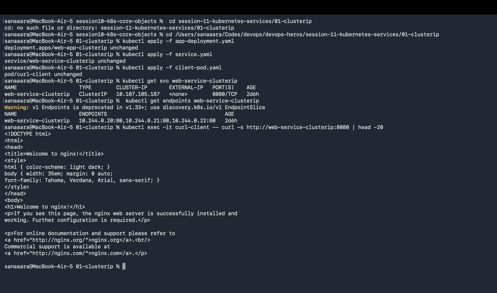
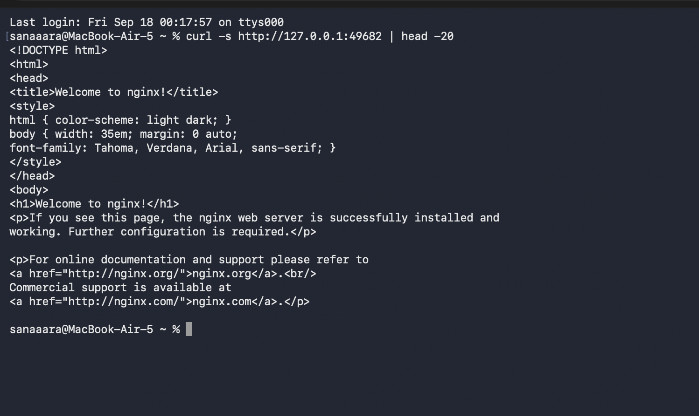
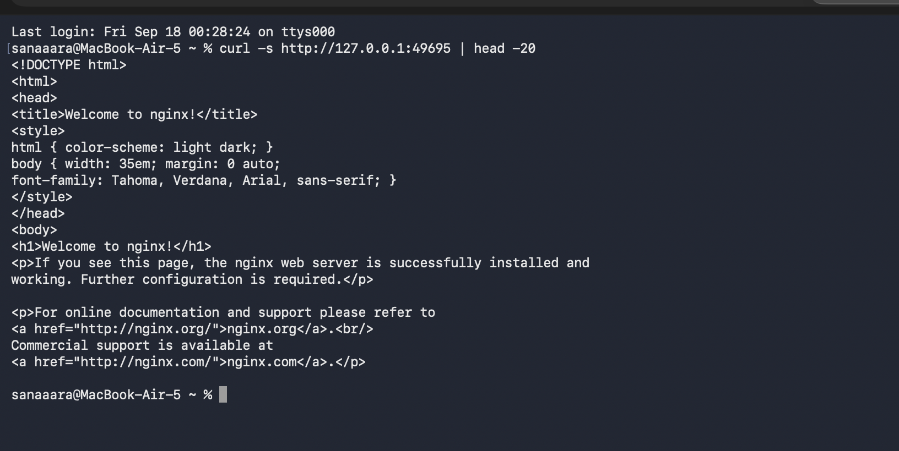
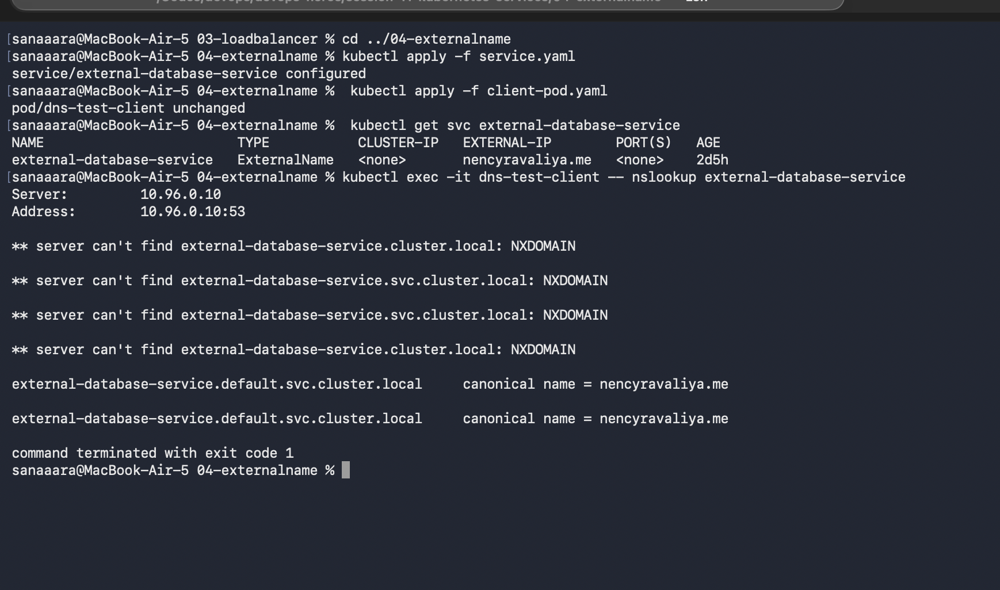
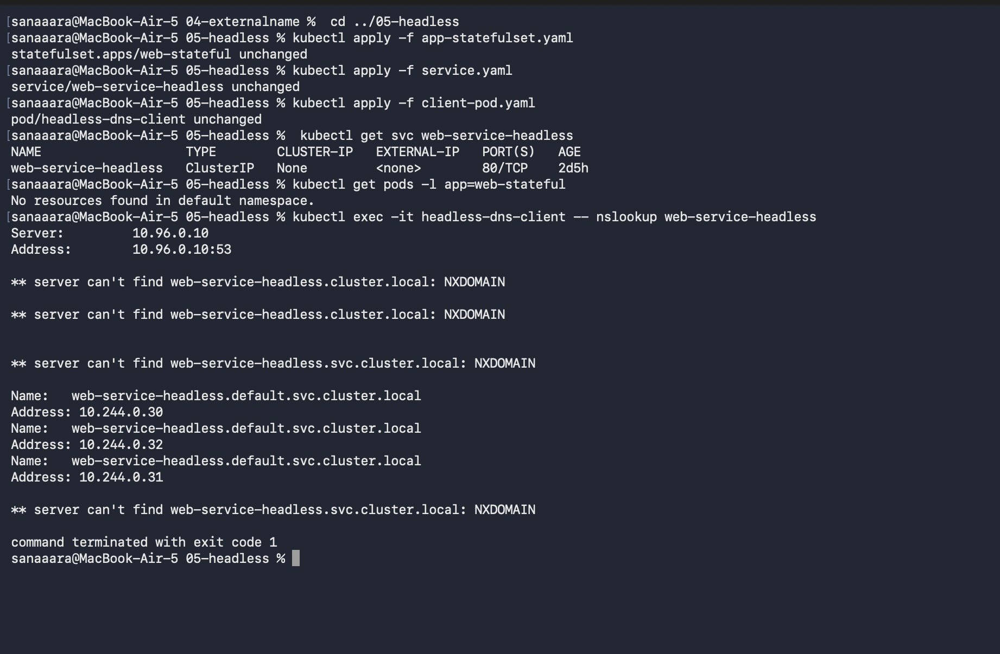

# Session 11 - Kubernetes Networking & Services

Worked through all 5 Kubernetes service types — ClusterIP, NodePort, LoadBalancer, ExternalName, and Headless — using the teacher's YAMLs.

---

## 1. ClusterIP — Internal only

Default service type. Gives pods a stable virtual IP that only works inside the cluster.

```bash
cd 01-clusterip
kubectl apply -f app-deployment.yaml
kubectl apply -f service.yaml
kubectl apply -f client-pod.yaml
kubectl exec -it curl-client -- curl -s http://web-service-clusterip:8080
```



Curled the service from an internal client pod using CoreDNS — got the nginx welcome page.

---

## 2. NodePort — External via node port

Opens a static high port (30000–32767) on every node so external traffic can reach the service.

```bash
cd ../02-nodeport
kubectl apply -f app-deployment.yaml
kubectl apply -f service.yaml
minikube service web-service-nodeport --url
# in another terminal
curl -s http://127.0.0.1:<PORT>
```



Same nginx page but this time reached from outside the cluster via the NodePort.

---

## 3. LoadBalancer — Cloud LB (pending on Minikube)

In a real cloud (AWS/GCP/Azure) this provisions a public load balancer. On Minikube the EXTERNAL-IP stays `<pending>` since there's no cloud provider — but Minikube's tunnel still gives us a way to hit it.

```bash
cd ../03-loadbalancer
kubectl apply -f app-deployment.yaml
kubectl apply -f service.yaml
kubectl get svc web-service-loadbalancer
minikube service web-service-loadbalancer --url
```



`EXTERNAL-IP` shows `<pending>` — expected local behavior.

---

## 4. ExternalName — DNS alias to external service

No pods, no IP. Just a CNAME redirect handled entirely by CoreDNS.

```bash
cd ../04-externalname
kubectl apply -f service.yaml
kubectl apply -f client-pod.yaml
kubectl exec -it dns-test-client -- nslookup external-database-service
```



The service name resolved to `api.github.com` (the external target) through the cluster's DNS.

---

## 5. Headless Service — `clusterIP: None`

No virtual IP allocated. DNS returns the actual pod IPs directly. Used with StatefulSets for stateful clustered systems (Kafka, MongoDB, Cassandra etc).

```bash
cd ../05-headless
kubectl apply -f app-statefulset.yaml
kubectl apply -f service.yaml
kubectl apply -f client-pod.yaml
kubectl exec -it headless-dns-client -- nslookup web-service-headless
```



nslookup returned multiple A records — one per stateful pod — instead of a single VIP.

---

## Summary

| Service | Internal Only? | External Access | Real Use |
|---|---|---|---|
| ClusterIP | Yes | No | Microservice-to-microservice communication |
| NodePort | No | via node IP:port | On-prem, dev/testing |
| LoadBalancer | No | via cloud LB IP | Public-facing web apps in cloud |
| ExternalName | N/A | CNAME to external FQDN | Access RDS/Mongo Atlas by internal name |
| Headless | Yes | No (direct pod IPs) | StatefulSets (Kafka, MongoDB, etc) |
