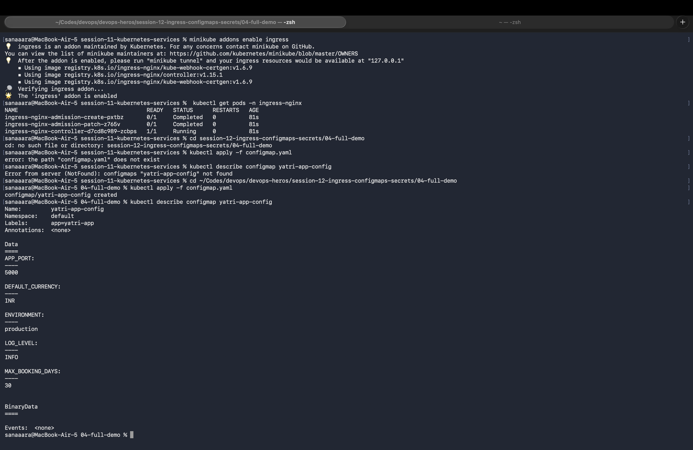
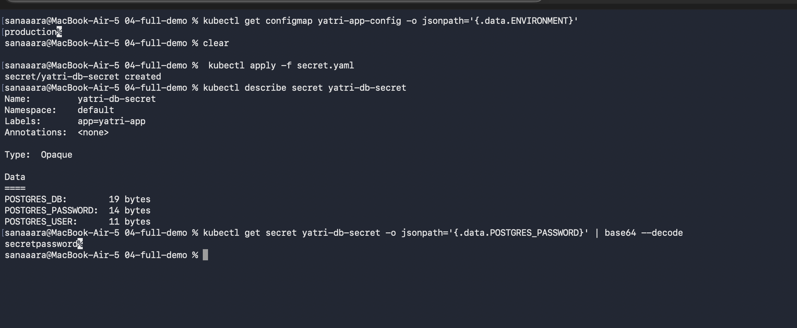
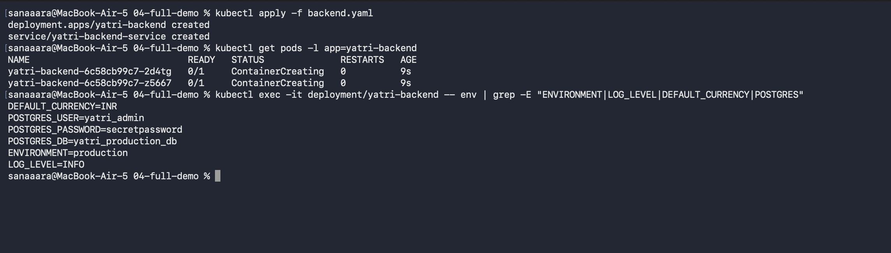
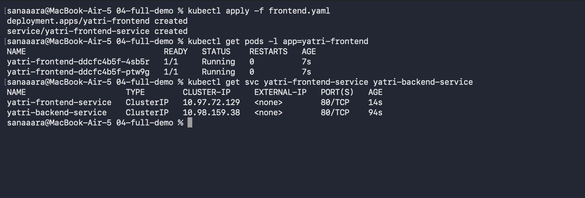
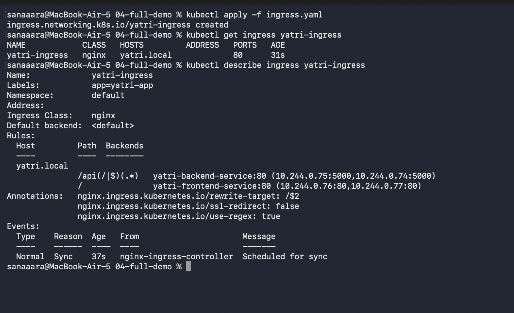

# Session 12 - Kubernetes Ingress, ConfigMaps & Secrets

Ran the full end-to-end demo from `04-full-demo/` — ConfigMap and Secret feeding a backend deployment, a frontend, and an Ingress routing traffic to both.

---

## Setup — Enable Ingress on Minikube

```bash
minikube addons enable ingress
kubectl get pods -n ingress-nginx
```

Waited until the `ingress-nginx-controller` pod was Running.

---

## 1. ConfigMap

Plain-text app configuration decoupled from the container image.

```bash
cd 04-full-demo
kubectl apply -f configmap.yaml
kubectl describe configmap yatri-app-config
```



5 keys stored — environment, log level, port, currency, max booking days.

---

## 2. Secret

Sensitive data (DB creds) stored as base64-encoded values.

```bash
kubectl apply -f secret.yaml
kubectl describe secret yatri-db-secret
kubectl get secret yatri-db-secret -o jsonpath='{.data.POSTGRES_PASSWORD}' | base64 --decode
```



`describe` masks values with byte counts. But anyone with `kubectl get` access can decode them — base64 is encoding, not encryption. RBAC is what actually protects Secrets.

---

## 3. Backend — Consumes ConfigMap + Secret

Backend deployment pulls all 5 ConfigMap keys via `envFrom` and 3 Secret keys via individual `secretKeyRef` entries.

```bash
kubectl apply -f backend.yaml
kubectl exec -it deployment/yatri-backend -- env | grep -E "ENVIRONMENT|LOG_LEVEL|DEFAULT_CURRENCY|POSTGRES"
```



Both ConfigMap values and Secret values available as normal environment variables inside the pod.

---

## 4. Frontend

```bash
kubectl apply -f frontend.yaml
kubectl get svc yatri-frontend-service yatri-backend-service
```



Both services are `ClusterIP` — internal only, which is why Ingress is needed to expose them.

---

## 5. Ingress — One entry point for both services

Single Ingress with two path rules: `/` → frontend, `/api/*` → backend.

```bash
kubectl apply -f ingress.yaml
kubectl get ingress yatri-ingress
kubectl describe ingress yatri-ingress
```



The `ADDRESS` column populated with the Minikube IP, and the describe output shows both routing rules attached to host `yatri.local`.
