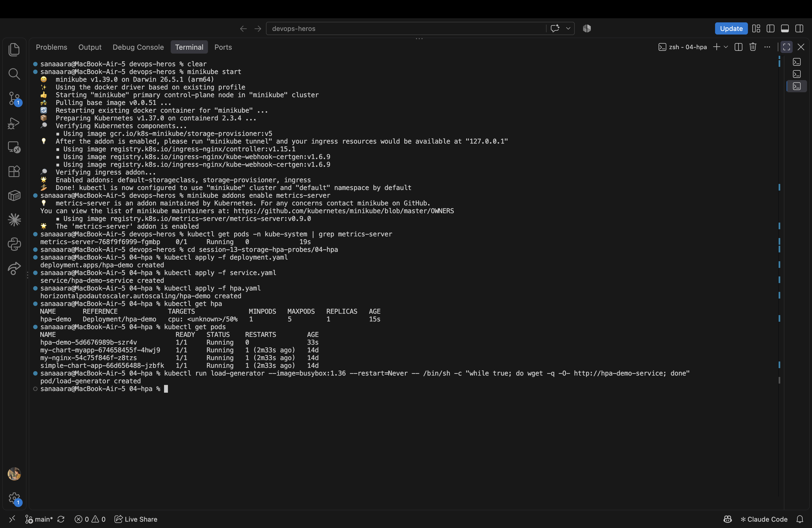
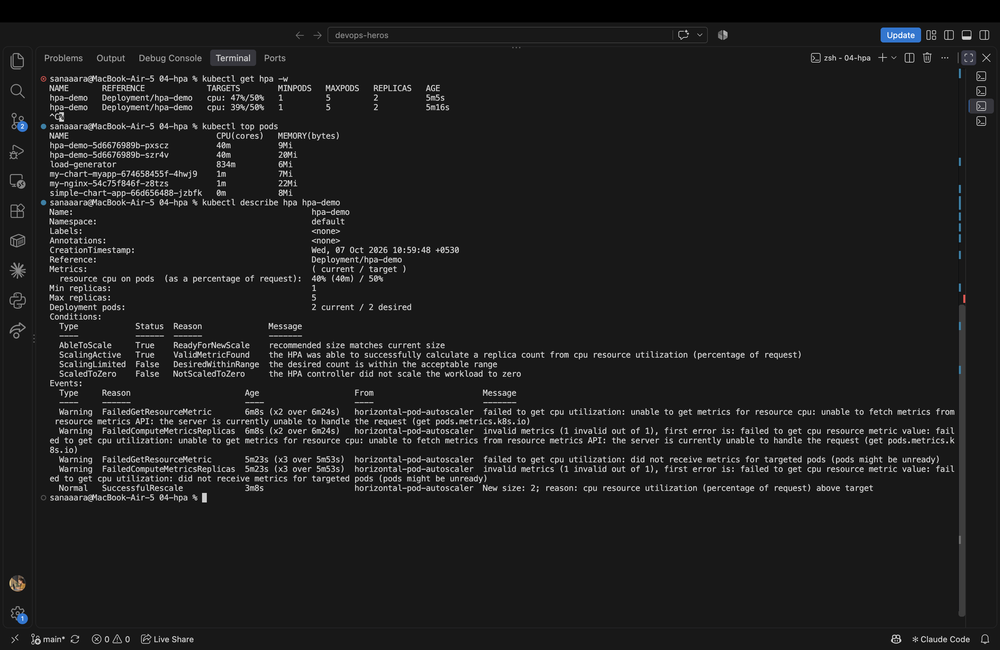
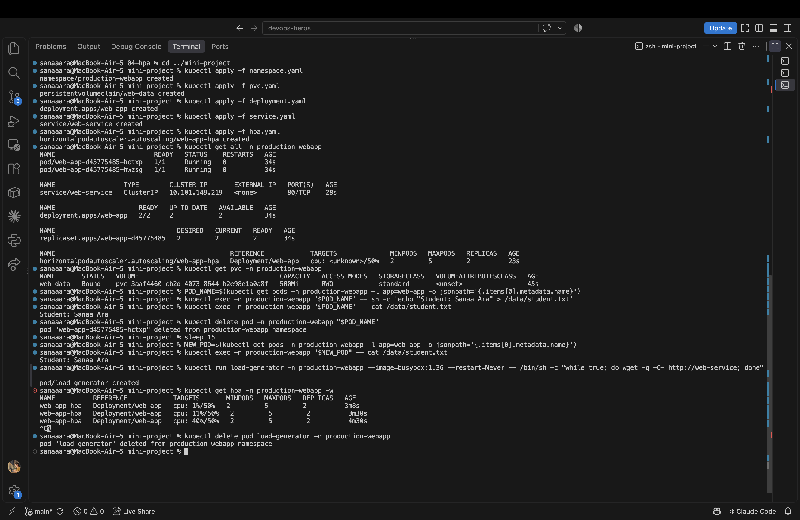

# Session 13 - Kubernetes Storage, HPA & Probes

Three tasks: wrote up the volumes docs, did the HPA hands-on with the teacher's `04-hpa/` setup, and ran the full mini-project end-to-end.

---

## Task 1 — Kubernetes Volumes Documentation

Full write-up on emptyDir, hostPath, PersistentVolume, PersistentVolumeClaim, StorageClass, and Dynamic Provisioning here:

[01-kubernetes-volumes/README.md](01-kubernetes-volumes/README.md)

Covers what each volume type is, when to use it, YAML examples, and a quick comparison table.

---

## Task 2 — HPA Hands-on (`04-hpa/`)

Enabled the metrics-server addon first (HPA needs CPU metrics to decide when to scale):

```bash
minikube addons enable metrics-server
```

Deployed the app, service, and HPA:

```bash
cd 04-hpa
kubectl apply -f deployment.yaml
kubectl apply -f service.yaml
kubectl apply -f hpa.yaml
kubectl get hpa
kubectl get pods
```

HPA shows `0%/50%` with 1 replica initially.



Spawned a load generator that spams the service in an infinite loop:

```bash
kubectl run load-generator --image=busybox:1.36 --restart=Never -- \
  /bin/sh -c "while true; do wget -q -O- http://hpa-demo-service; done"
```

Watched HPA scale as CPU climbed past 50%, and checked top pods + describe hpa:

```bash
kubectl get hpa -w
kubectl top pods
kubectl describe hpa hpa-demo
```



Replicas scaled from 1 up to the max as the CPU utilization crossed the 50% target. After stopping the load generator, HPA scaled back down after the stabilization window.

```bash
kubectl delete pod load-generator
```

---

## Task 3 — Mini Project (Production-ready web app)

Capstone combining PVC (storage), HPA (scaling), and probes (health) in a dedicated namespace.

```bash
cd ../mini-project
kubectl apply -f namespace.yaml
kubectl apply -f pvc.yaml
kubectl apply -f deployment.yaml
kubectl apply -f service.yaml
kubectl apply -f hpa.yaml
kubectl get all -n production-webapp
kubectl get pvc -n production-webapp
```

Then verified storage persistence (wrote a file, deleted the pod, confirmed the new pod still had the file) and triggered HPA scaling with a load generator inside the namespace:

```bash
POD_NAME=$(kubectl get pods -n production-webapp -l app=web-app -o jsonpath='{.items[0].metadata.name}')
kubectl exec -n production-webapp "$POD_NAME" -- sh -c 'echo "Student: Sanaa Ara" > /data/student.txt'
kubectl delete pod -n production-webapp "$POD_NAME"
# new pod comes up — file survives
NEW_POD=$(kubectl get pods -n production-webapp -l app=web-app -o jsonpath='{.items[0].metadata.name}')
kubectl exec -n production-webapp "$NEW_POD" -- cat /data/student.txt

kubectl run load-generator -n production-webapp --image=busybox:1.36 --restart=Never -- \
  /bin/sh -c "while true; do wget -q -O- http://web-service; done"
kubectl get hpa -n production-webapp -w
```



Deployment came up with 2 replicas (as per HPA min), PVC bound successfully, file written to `/data` survived pod deletion (proving persistent storage works), and HPA scaled replicas up as the load generator pushed CPU past 50%.

---

## What I took away

- **Volumes vs PVC:** `emptyDir`/`hostPath` are node-scoped and ephemeral; PVC-backed storage survives pod deletion and reschedules.
- **HPA needs metrics-server + CPU requests.** Without `resources.requests.cpu`, HPA shows `<unknown>` because it can't compute utilization.
- **Scale-up is fast, scale-down is deliberate.** HPA waits a stabilization window (~5 min) before scaling down, to avoid flapping.
