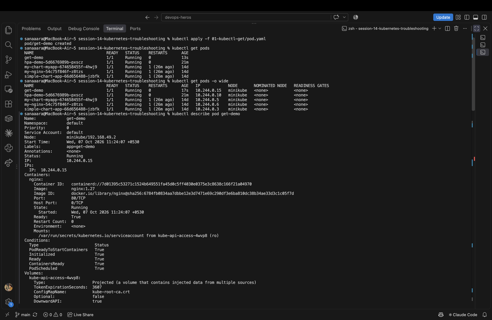
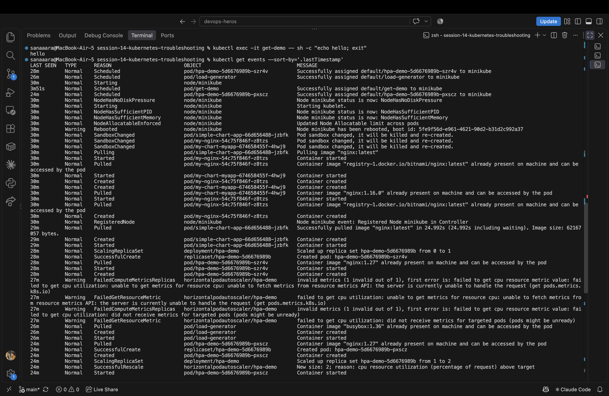
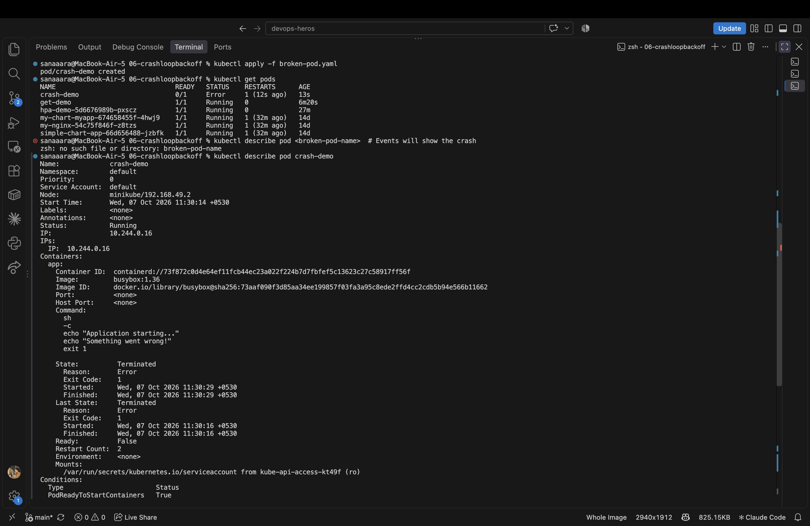
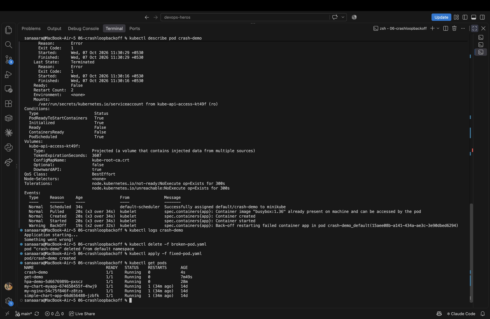
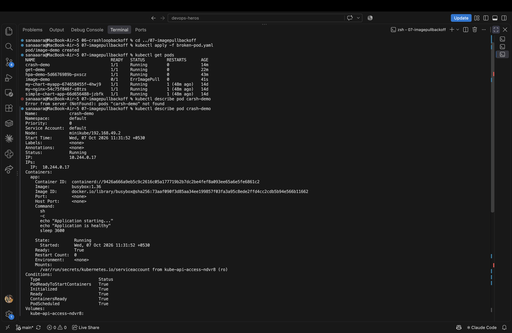
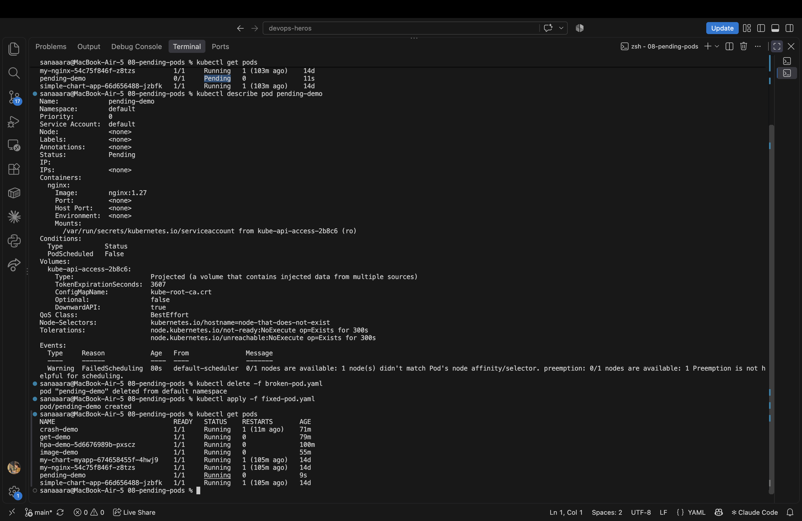
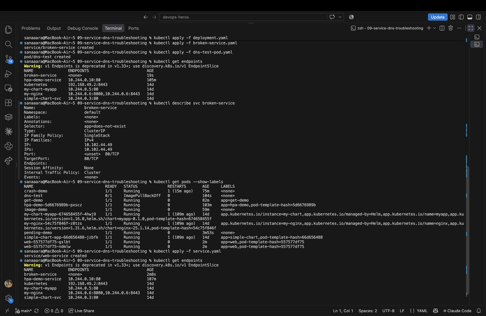
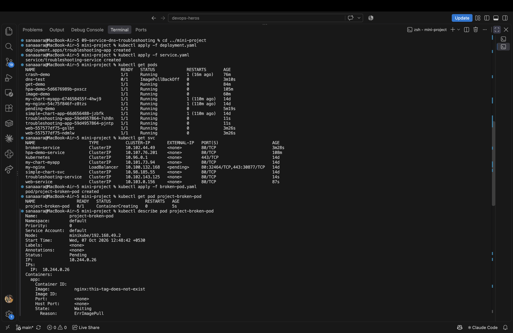
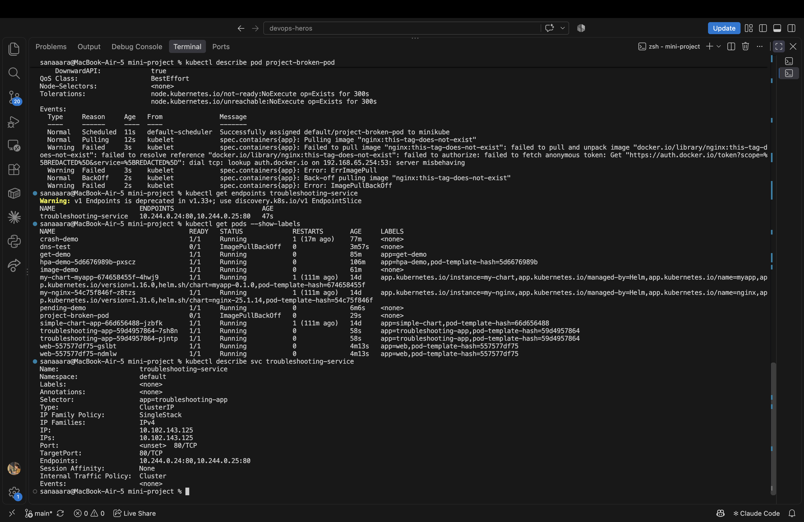

# Session 14 - Kubernetes Troubleshooting

Practiced core debugging commands and worked through the common pod failure modes — CrashLoopBackOff, ImagePullBackOff, Pending, and Service/DNS issues — plus the full mini-project.

---

## Task 1 — Core kubectl Commands

Applied one of the teacher's demo pods and ran through the full debugging toolbox:

```bash
kubectl apply -f 01-kubectl-get/pod.yaml
kubectl get pods
kubectl get pods -o wide
kubectl describe pod get-demo
kubectl logs get-demo
kubectl exec -it get-demo -- sh -c "echo hello"
kubectl get events --sort-by='.lastTimestamp'
kubectl explain pod
kubectl top pods
```



The go-to triage flow: **get → describe → logs → exec → events**.

---

## Task 2 — Troubleshoot Common Issues

### CrashLoopBackOff

Container starts, exits with an error, Kubernetes restarts it, it crashes again. Status cycles between `Running`, `Error`, and `CrashLoopBackOff`.

```bash
cd 06-crashloopbackoff
kubectl apply -f broken-pod.yaml
kubectl describe pod <pod-name>     # Events reveal the exit code
kubectl logs <pod-name>             # Shows the actual crash reason
kubectl delete -f broken-pod.yaml
kubectl apply -f fixed-pod.yaml
```



### ImagePullBackOff

Pod can't pull the container image — wrong name, missing tag, private registry without credentials.

```bash
cd ../07-imagepullbackoff
kubectl apply -f broken-pod.yaml
kubectl describe pod <pod-name>     # Events show "manifest for X not found"
kubectl delete -f broken-pod.yaml
kubectl apply -f fixed-pod.yaml
```



### Pending

Pod created but scheduler can't place it anywhere. Common causes: impossible CPU/memory requests, no matching nodes, PVC not bound.

```bash
cd ../08-pending-pods
kubectl apply -f broken-pod.yaml
kubectl describe pod <pod-name>     # Events: FailedScheduling + reason
kubectl delete -f broken-pod.yaml
kubectl apply -f fixed-pod.yaml
```



### Service / DNS Issue

Service selector doesn't match any pod labels, so the endpoint list is empty and nothing routes.

```bash
cd ../09-service-dns-troubleshooting
kubectl apply -f deployment.yaml
kubectl apply -f broken-service.yaml
kubectl get endpoints              # Shows <none> — the smoking gun
kubectl get pods --show-labels     # Compare pod labels vs service selector
kubectl describe svc <svc-name>
kubectl apply -f service.yaml      # Fix: correct selector
kubectl get endpoints              # Now populated
```







---

## Task 3 — Mini Project

Walked through the full troubleshoot flow on the teacher's broken deployment + broken-pod + mismatched service scenario.

```bash
cd ../mini-project
kubectl apply -f deployment.yaml
kubectl apply -f service.yaml
kubectl apply -f broken-pod.yaml

kubectl get pod project-broken-pod
kubectl describe pod project-broken-pod   # Image doesn't exist — ImagePullBackOff

kubectl get endpoints troubleshooting-service
kubectl get pods --show-labels            # Pod labels vs service selector mismatch
```





### Troubleshooting Table

| Problem | What I Saw | Command | Root Cause | Fix |
|---|---|---|---|---|
| Broken Pod | `ImagePullBackOff` | `kubectl describe pod` | Image tag doesn't exist | Apply fixed-pod with valid image |
| Service Problem | `endpoints: <none>` | `kubectl get endpoints` + `--show-labels` | Service selector doesn't match pod labels | Change selector to match |
| CrashLoop | repeated restarts | `kubectl logs --previous` | Container command exits non-zero | Fix the entrypoint/args |

---

## The Troubleshooting Mindset

> When something breaks: **DON'T GUESS.**

```
GET → DESCRIBE → EVENTS → LOGS → EXEC → TEST → FIX → VERIFY
```

`describe` is almost always where the answer is, especially the **Events** section at the bottom.
