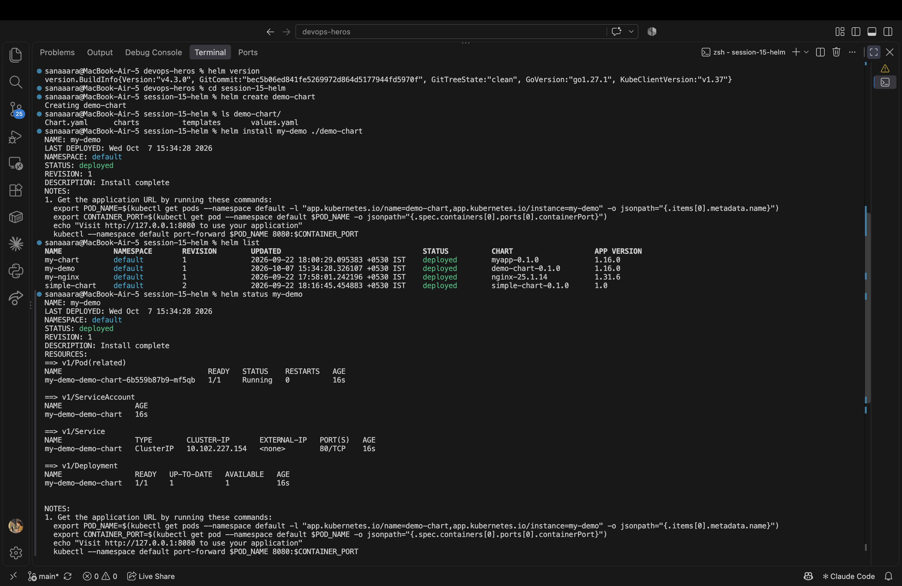
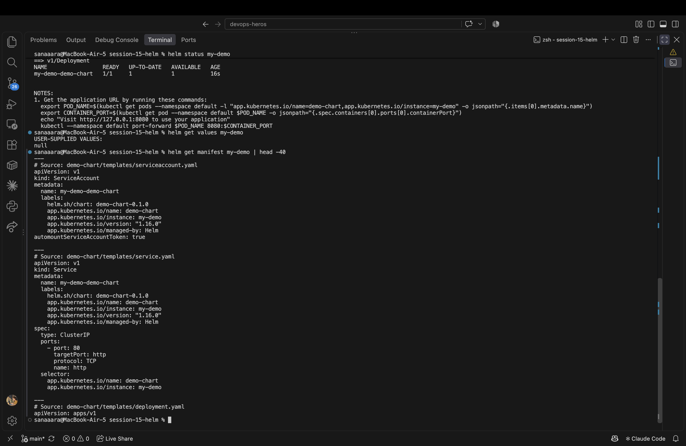
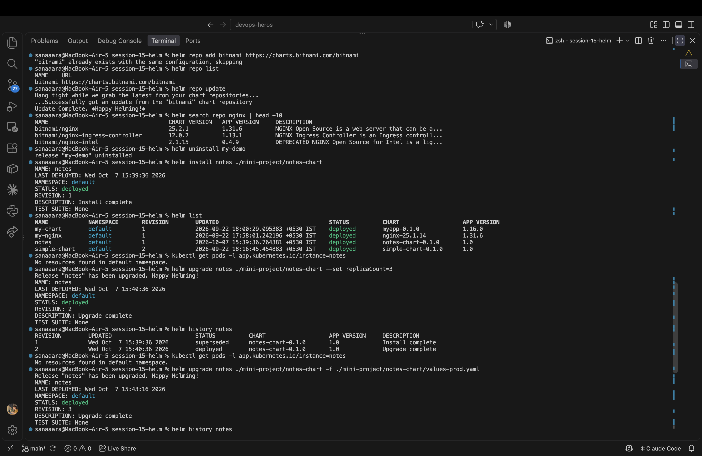
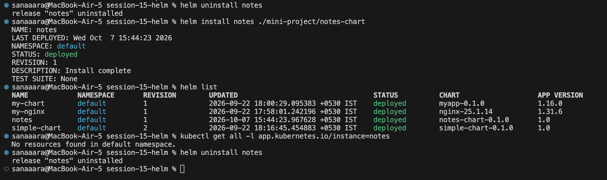

# Session 15 - Helm

Hands-on practice with every important Helm command, a full install → upgrade → rollback workflow, and the mini-project deploying the notes chart.

---

## Task 1 — Helm Commands Practice

Installed Helm and ran through the full command toolbox.

```bash
helm version

# create a chart to practice on
helm create demo-chart

# install it into the cluster
helm install my-demo ./demo-chart

# list / status / get
helm list
helm status my-demo
helm get values my-demo
helm get manifest my-demo | head -40
```



Added a public repo and searched it:

```bash
helm repo add bitnami https://charts.bitnami.com/bitnami
helm repo list
helm repo update
helm search repo nginx | head -10
helm uninstall my-demo
```



### Command Reference

| Command | What it does |
|---|---|
| `helm create` | Scaffolds a new chart with sample templates |
| `helm install` | Deploys a chart into the cluster as a release |
| `helm list` | Lists all releases in the current namespace |
| `helm status` | Shows the state of a release |
| `helm get` | Returns release info (values, manifest, hooks) |
| `helm upgrade` | Updates a release with new values or chart version |
| `helm history` | Shows all revisions of a release |
| `helm rollback` | Reverts a release to a previous revision |
| `helm uninstall` | Removes a release from the cluster |
| `helm repo` | Manages chart repositories (add/list/update/remove) |
| `helm search` | Searches repos for charts |

---

## Task 2 — Full Rollback Workflow

Install → upgrade → verify → upgrade again → verify → rollback → verify.

```bash
# step 1: install v1 (1 replica, nginx 1.24)
helm install notes ./mini-project/notes-chart
helm list

# step 2: upgrade to 3 replicas
helm upgrade notes ./mini-project/notes-chart --set replicaCount=3
helm history notes
kubectl get pods -l app.kubernetes.io/instance=notes

# step 3: upgrade to prod values (nginx 1.25)
helm upgrade notes ./mini-project/notes-chart -f ./mini-project/notes-chart/values-prod.yaml
helm history notes

# step 4: rollback to revision 1
helm rollback notes 1
helm history notes
kubectl get pods -l app.kubernetes.io/instance=notes
```



Helm's history shows every revision with its chart version, app version, and status. Rollback is instant — Helm just applies the manifest from the chosen revision again.

---

## Task 3 — Mini Project (Notes Chart)

Installed and verified the teacher's notes chart which packages an nginx-based notes app with environment-specific values.

```bash
helm uninstall notes
helm install notes ./mini-project/notes-chart
helm list
kubectl get all -l app.kubernetes.io/instance=notes
```



The chart ships with:
- `Chart.yaml` — chart metadata (name, version, appVersion)
- `values.yaml` — default values (dev: 1 replica, nginx 1.24)
- `values-prod.yaml` — production overrides (3 replicas, nginx 1.25)
- `templates/` — deployment, service, configmap manifests parameterized by values

Switching environments is just passing a different values file.

---

## What I took away

- **Charts are versioned, releases are tracked.** Every `helm install`/`upgrade` creates a new revision — no state drift, no mystery.
- **Rollback is free insurance.** If an upgrade breaks something, `helm rollback <release> <revision>` is one command.
- **Values files are the configuration boundary.** Same chart, different environments, just different values.
