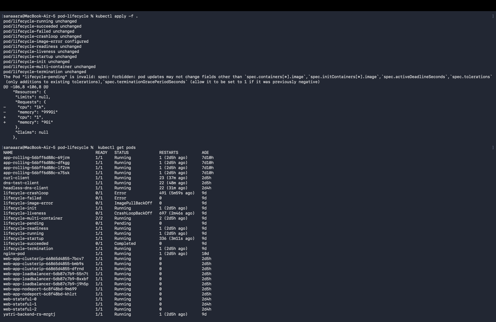
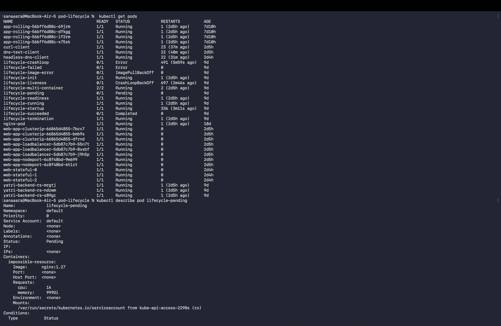
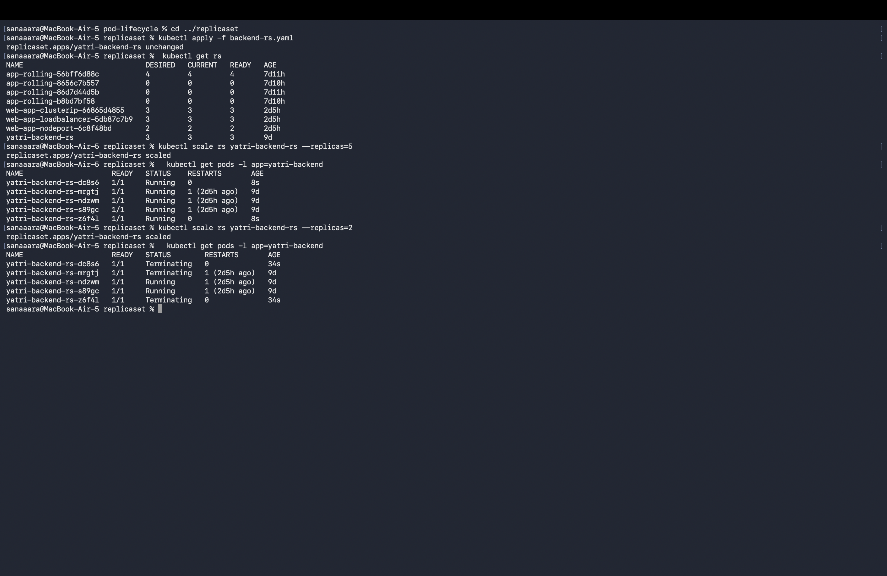
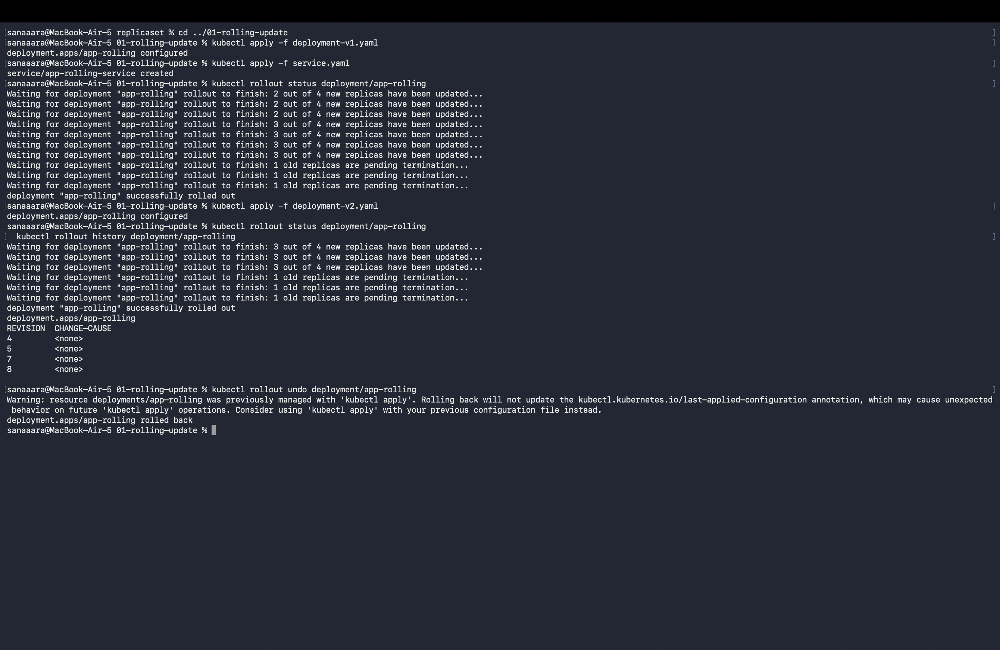
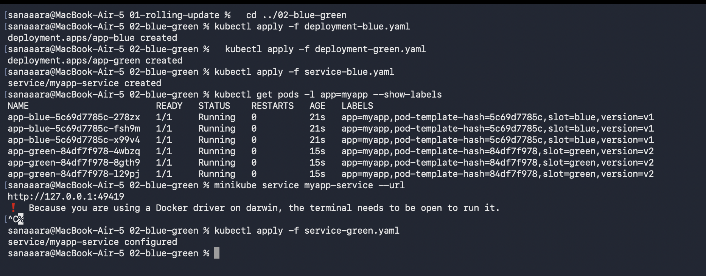
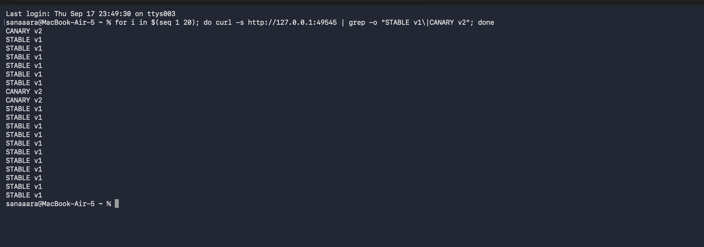
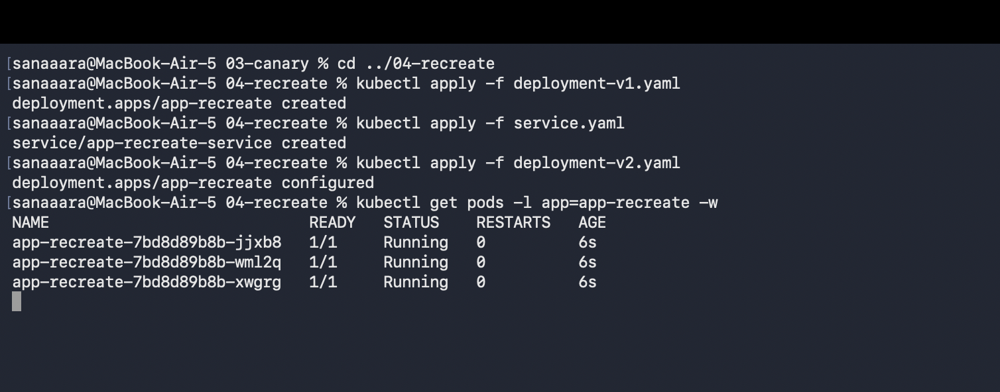

# Session 10 - Kubernetes Pods, ReplicaSets & Deployments

Worked through the pod lifecycle lab, played with ReplicaSet scaling, and ran all 4 deployment strategies (rolling update, blue-green, canary, recreate). Everything from the teacher's YAMLs.

---

## Part 1 — Pod Lifecycle Lab

Applied all 12 lifecycle YAMLs and observed how each pod ended up in a different state — Running, Pending, Completed, Error, CrashLoopBackOff, ImagePullBackOff, etc.

```bash
cd pod-lifecycle
kubectl apply -f .
kubectl get pods
```



Digged deeper into the pending pod to see why it wasn't scheduling:

```bash
kubectl describe pod lifecycle-pending
```



The pending pod was requesting impossible CPU/memory so the scheduler couldn't place it.

---

## Part 2 — ReplicaSet Scaling

```bash
cd ../replicaset
kubectl apply -f backend-rs.yaml
kubectl scale rs yatri-backend-rs --replicas=5
kubectl get pods -l app=yatri-backend
kubectl scale rs yatri-backend-rs --replicas=2
kubectl get pods -l app=yatri-backend
```



ReplicaSet quickly created and terminated pods to match the desired count.

---

## Part 3 — Rolling Update

Default deployment strategy — no downtime. Old pods gradually replaced by new ones.

```bash
cd ../01-rolling-update
kubectl apply -f deployment-v1.yaml
kubectl apply -f service.yaml
kubectl apply -f deployment-v2.yaml
kubectl rollout status deployment/app-rolling
kubectl rollout history deployment/app-rolling
kubectl rollout undo deployment/app-rolling
```



---

## Part 4 — Blue-Green Deployment

Two identical environments running side by side. Switching traffic is just a service selector change.

```bash
cd ../02-blue-green
kubectl apply -f deployment-blue.yaml
kubectl apply -f deployment-green.yaml
kubectl apply -f service-blue.yaml
# curl → BLUE
kubectl apply -f service-green.yaml
# curl → GREEN (instant switch)
```



---

## Part 5 — Canary Deployment

Small percentage of traffic goes to the new version. In this setup: 9 stable pods (v1) + 1 canary pod (v2) = 90/10 split.

```bash
cd ../03-canary
kubectl apply -f deployment-stable.yaml
kubectl apply -f service.yaml
kubectl apply -f deployment-canary.yaml
minikube service myapp-canary-service --url
# in another terminal
for i in $(seq 1 20); do curl -s http://127.0.0.1:<PORT> | grep -o "STABLE v1\|CANARY v2"; done
```



Most requests hit stable, occasional ones hit canary — proving the ratio-based traffic split works.

---

## Part 6 — Recreate Strategy

All old pods killed first, then new ones start. Causes downtime — used only when v1 and v2 can't coexist (schema migrations, RWO volumes).

```bash
cd ../04-recreate
kubectl apply -f deployment-v1.yaml
kubectl apply -f service.yaml
kubectl apply -f deployment-v2.yaml
kubectl get pods -l app=app-recreate -w
```



All v1 pods went Terminating simultaneously, cluster had zero pods for a moment, then v2 pods came up.

---

## Strategy Comparison

| Strategy | Downtime | Extra resources | Best for |
|---|---|---|---|
| Rolling Update | None | Low | Default for stateless apps |
| Blue-Green | None | 2x pods | Mission-critical, atomic cutover |
| Canary | None | Small extra pool | Real-user validation |
| Recreate | Yes | None | Schema migrations, RWO volumes |
