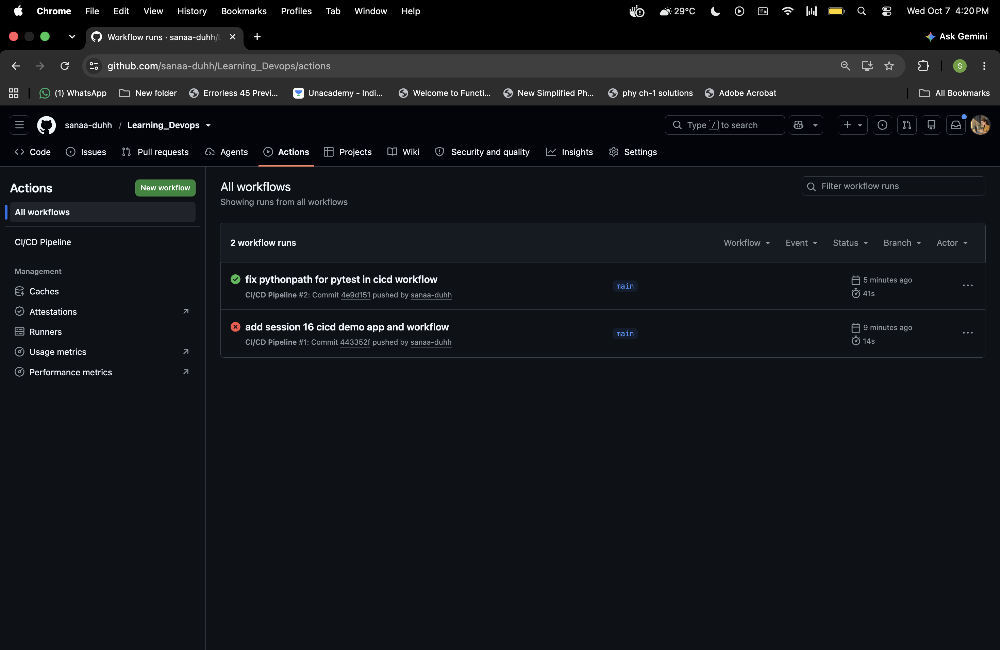
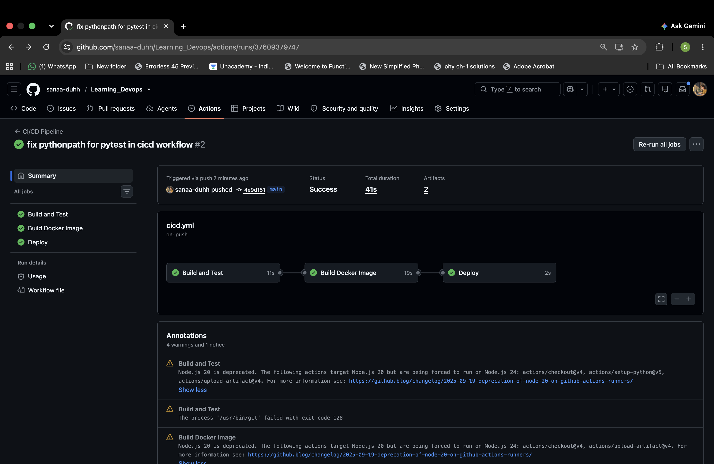
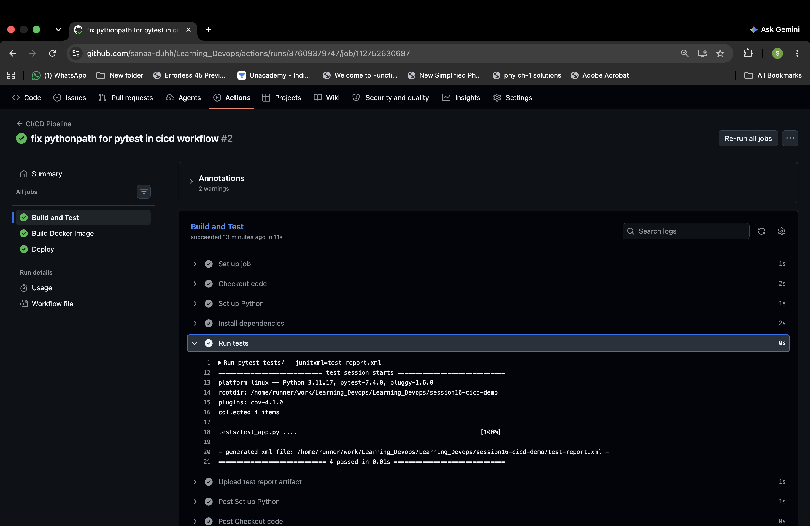
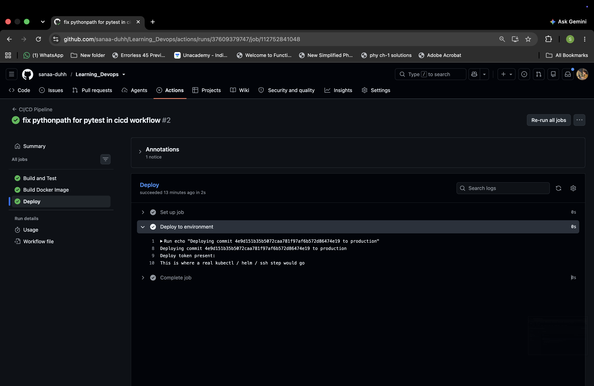
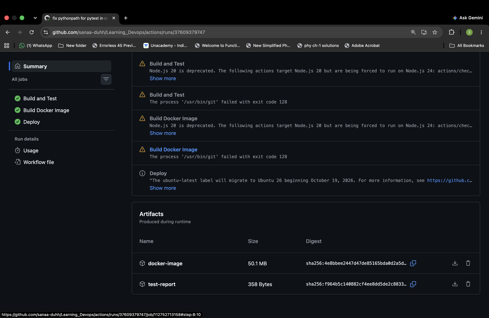

# Session 16 - CI/CD & GitHub Actions

Built a complete CI/CD pipeline using GitHub Actions for a Python demo app. Covers CI (build + test), image packaging, artifacts, secrets, and a CD step gated on the main branch.

**Workflow:** [`.github/workflows/cicd.yml`](../.github/workflows/cicd.yml)
**App:** Python module with `add`/`subtract`/`divide` functions + pytest tests + Dockerfile

---

## CI vs CD

- **Continuous Integration** — every push and PR runs tests and builds. Catches bugs before they land. In this project: the `build-and-test` and `docker-build` jobs.
- **Continuous Deployment** — automatically ships what passed CI. In this project: the `deploy` job, which only runs on `main`.

---

## Pipeline Structure

```
    push / PR / manual
            ↓
   ┌─────────────────┐
   │  Build and Test │   ← pytest + upload test-report artifact
   └────────┬────────┘
            ↓
   ┌─────────────────┐
   │ Build Docker    │   ← docker build + save image.tar artifact
   │     Image       │
   └────────┬────────┘
            ↓
   ┌─────────────────┐
   │     Deploy      │   ← uses DEPLOY_TOKEN secret, main-only
   └─────────────────┘
```

Jobs are chained with `needs:` so each stage only runs if the previous one passed.

---

## Concepts Mapped to the Workflow

| Concept | Where it shows up |
|---|---|
| Workflow | `cicd.yml` itself |
| Jobs | `build-and-test`, `docker-build`, `deploy` |
| Steps | each `- name:` block inside a job |
| Runners | `runs-on: ubuntu-latest` (GitHub-hosted VM) |
| Triggers | `push`, `pull_request`, `workflow_dispatch` |
| Secrets | `${{ secrets.DEPLOY_TOKEN }}` in the deploy job |
| Artifacts | `actions/upload-artifact@v4` for test report and image |
| Build | `pip install` + `docker build` |
| Test | `pytest tests/` with JUnit XML output |

---

## Pipeline Execution

### 1. Actions tab showing the successful run



### 2. Job graph — three stages chained



### 3. Test step — pytest output inside Build and Test job



All 4 tests passed: `test_add`, `test_subtract`, `test_divide`, `test_divide_by_zero`.

### 4. Deploy step — secret injection working



The `DEPLOY_TOKEN` secret from repo settings gets injected as an env var only at runtime inside the deploy job.

### 5. Artifacts section — downloadable outputs



Two artifacts attached to the run: the pytest JUnit report and the Docker image tarball.

---

## Running Locally

```bash
cd session16-cicd-demo
pip install -r requirements.txt
pytest tests/
docker build -t cicd-demo .
```

---

## What I took away

- **CI stops bad code from merging; CD stops good code from waiting.** The pipeline enforces both.
- **Artifacts > rebuilds.** The image built once in CI gets passed to CD, so what you tested is literally what gets deployed.
- **Secrets never leak into the YAML.** They live in GitHub's secret store and get injected into the job env only when the step runs.
