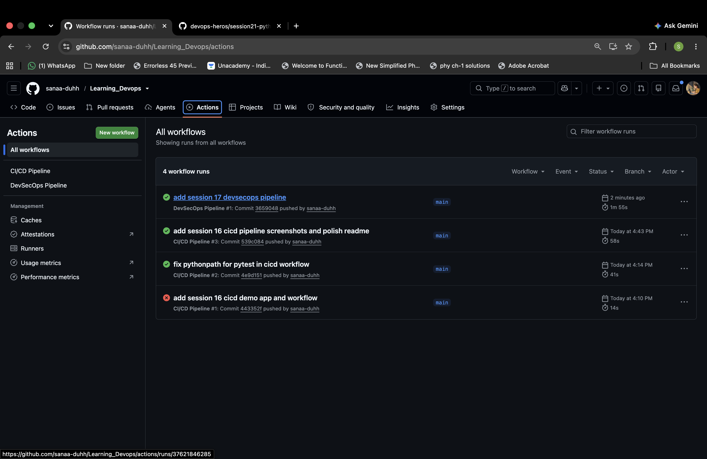
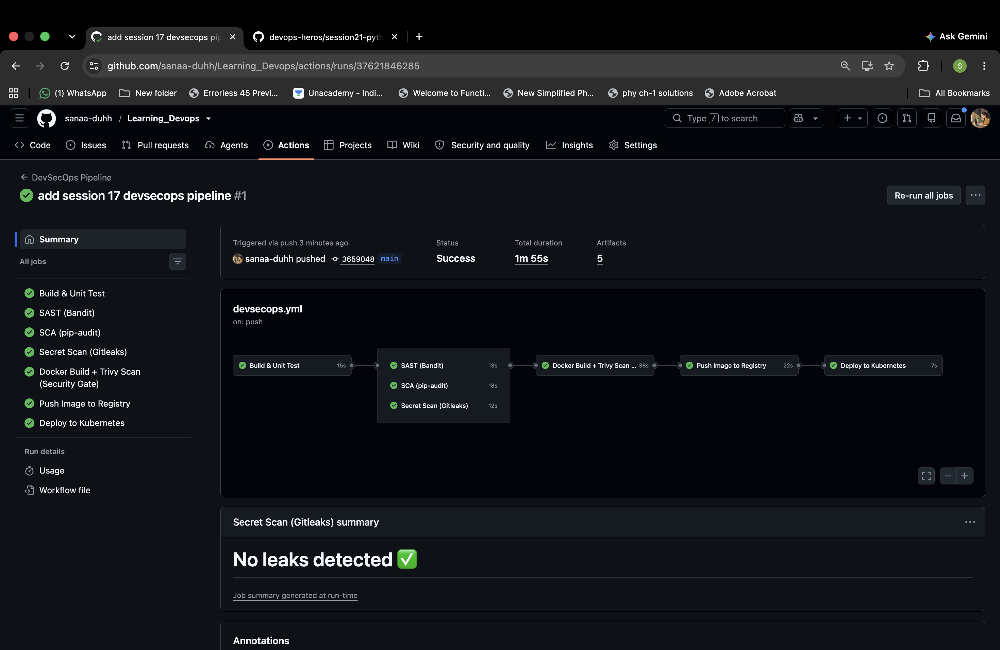
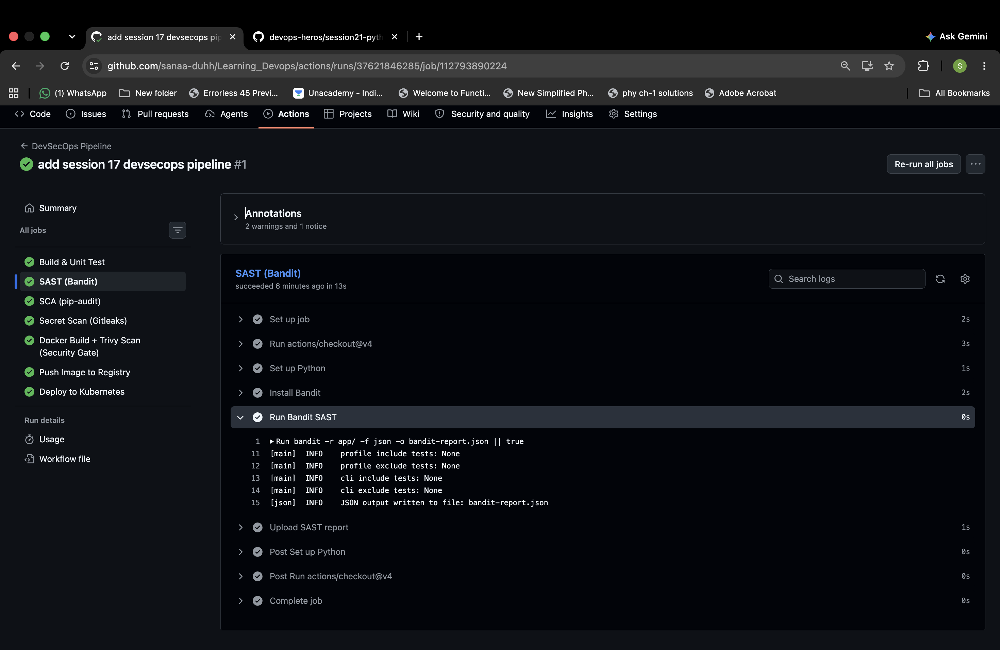
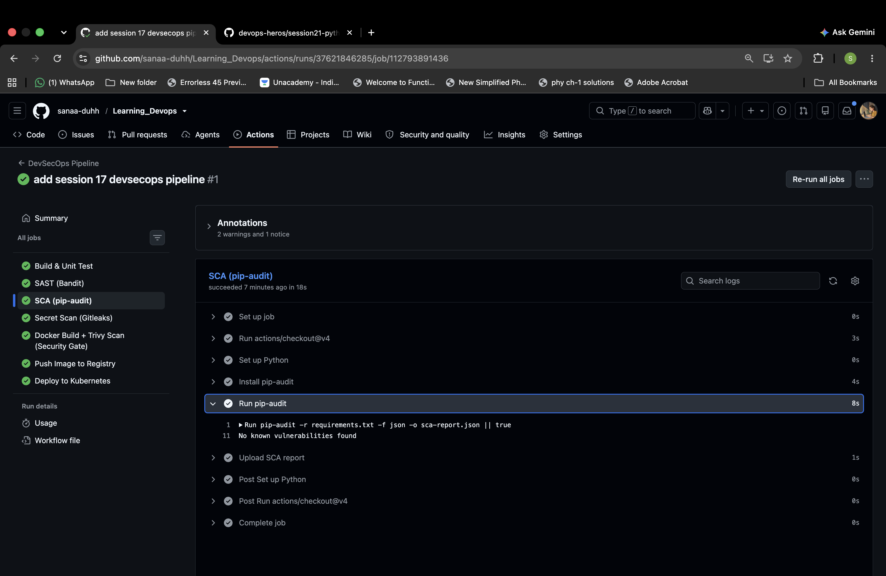
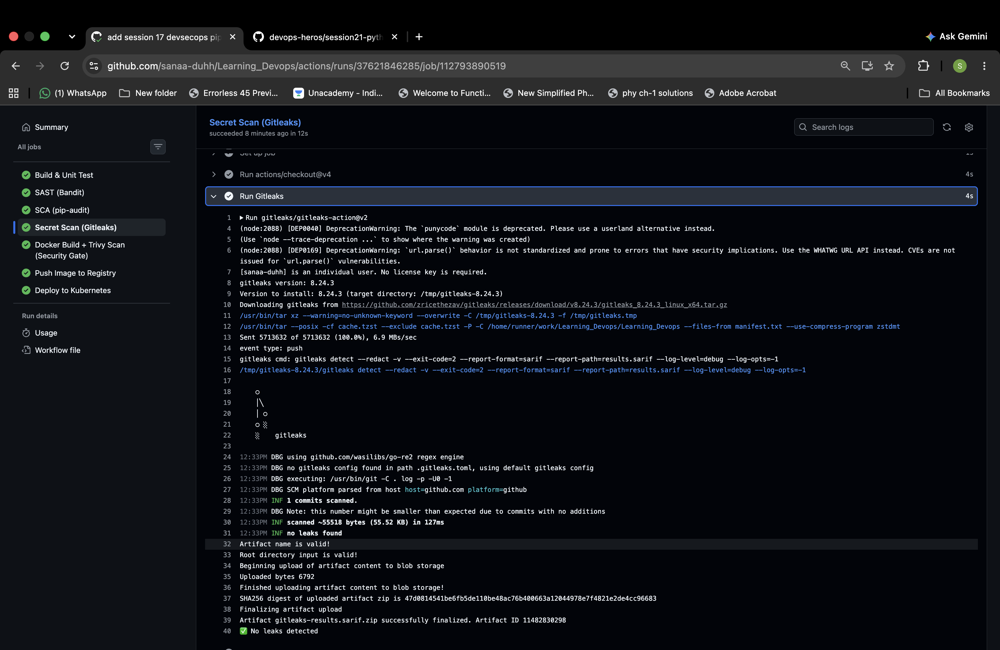
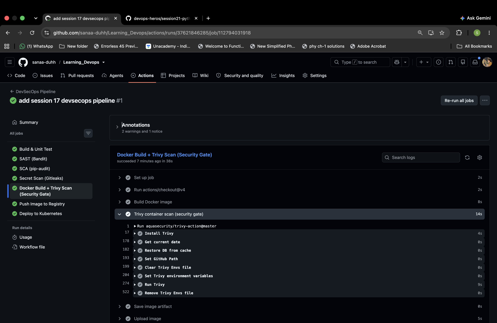
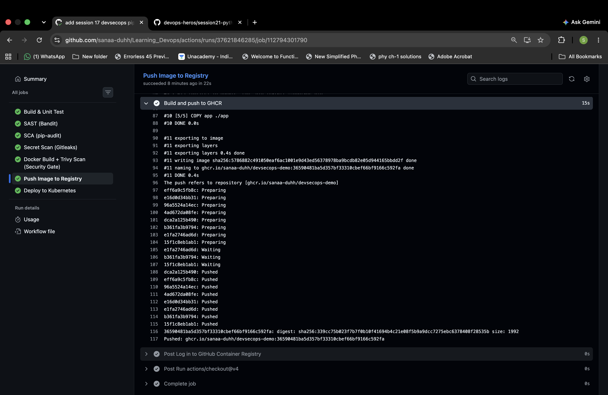
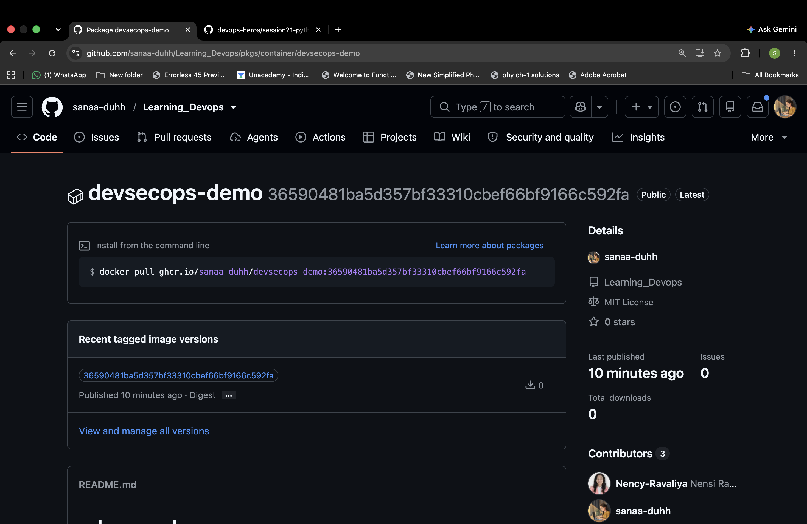

# Session 17 - Complete CI/CD & DevSecOps

Built a GitHub Actions pipeline for the Flask demo application, covering unit tests, security scans, Docker packaging, and publication to GitHub Container Registry. The final job demonstrates the Kubernetes deployment step by printing the manifests.

**Workflow:** [`.github/workflows/devsecops.yml`](../.github/workflows/devsecops.yml)

**Application:** [`app/app.py`](app/app.py)

**Tests:** [`tests/test_app.py`](tests/test_app.py)

**Container:** [`Dockerfile`](Dockerfile)

**Kubernetes:** [Deployment](k8s/deployment.yaml) · [Service](k8s/service.yaml)

---

## Task — DevSecOps Demo Project

The application provides a dashboard, health and status endpoints, greeting and arithmetic APIs. It is packaged with Flask 3.1.3 in a Python 3.12 slim Docker image and listens on port 5001.

The workflow runs on pushes to `main` that change the demo or workflow, on pull requests targeting `main`, and through manual dispatch. Registry publication and the deployment demonstration run only on `main`.

### Pipeline Structure

```text
Build & Unit Test
        |
        +-- SAST (Bandit) --------+
        +-- SCA (pip-audit) ------+--> Docker Build + Trivy Scan
        +-- Secret Scan ---------+                |
                                              Push to GHCR
                                                   |
                                        Kubernetes deploy simulation
```

The three security jobs run in parallel after the tests. The Docker job depends on all three through `needs:`; publication and deployment follow it.

| Stage | Tool | What the workflow does |
|---|---|---|
| Build & unit test | Python 3.11, pytest | Installs dependencies, runs eight tests, uploads the JUnit report |
| SAST | Bandit | Scans the Python application and saves a JSON report |
| SCA | pip-audit | Checks dependencies from `requirements.txt` for known vulnerabilities |
| Secret scanning | Gitleaks | Checks Git changes for exposed credentials and saves a SARIF report |
| Docker build & image scan | Docker, Trivy | Builds the image, scans HIGH/CRITICAL findings, uploads `image.tar` |
| Container registry | GHCR | Authenticates with `GITHUB_TOKEN`, builds and pushes a commit-tagged image |
| Kubernetes deployment | Deployment and Service manifests | Prints the intended apply command and both manifests |

---

## Pipeline Execution

### 1. Successful Workflow Run

The Actions page shows the DevSecOps pipeline completed successfully for commit `3659048` on `main`.



### 2. Job Dependencies and Overall Result

The run summary shows all seven jobs completed successfully in **1 minute 55 seconds**, with five artifacts. The graph shows the security checks running in parallel between testing and the Docker build.



The first job runs:

```bash
pytest tests/ --junitxml=test-report.xml
```

The eight tests cover the home page, health endpoint, greeting, addition, missing input, multiplication, division by zero, and application status.

### 3. SAST — Bandit

Bandit examines the application's Python source for security issues. The job writes its findings to `bandit-report.json` and uploads that file as an artifact.

```bash
bandit -r app/ -f json -o bandit-report.json || true
```

The screenshot confirms the scan ran and the JSON report was written.



### 4. SCA — pip-audit

Dependency scanning checks the packages installed from `requirements.txt`. The captured output reports **no known vulnerabilities found**.

```bash
pip-audit -r requirements.txt -f json -o sca-report.json || true
```



### 5. Secret Scanning — Gitleaks

The workflow uses `gitleaks/gitleaks-action@v2` with the automatically supplied `GITHUB_TOKEN`. The log shows one commit scanned, **no leaks found**, and the SARIF artifact uploaded. The run summary also displays “No leaks detected.”



### 6. Docker Build and Container Image Scanning

After the security jobs finish, Docker builds the image with the commit SHA as its tag:

```bash
docker build -t devsecops-demo:${{ github.sha }} .
```

Trivy scans the built image with this configuration:

```yaml
image-ref: 'devsecops-demo:${{ github.sha }}'
format: 'table'
exit-code: '0'
severity: 'CRITICAL,HIGH'
```

The screenshot shows the Trivy step completed, followed by image saving and artifact upload. Its scan output is collapsed, so this capture does not establish vulnerability counts.



### Security Gate Configuration

The scans are configured to collect results without blocking this demo: Bandit and pip-audit use `|| true`, Gitleaks uses `continue-on-error: true`, and Trivy uses `exit-code: '0'`. A successful workflow therefore shows that the jobs completed; the individual reports still need to be reviewed.

To enforce a blocking security gate, the scan failures would need to propagate to the job result, including a nonzero Trivy exit code for the selected severities.

### 7. Push Image to GitHub Container Registry

The registry job uses `packages: write` and `contents: read` permissions. It logs into `ghcr.io` with `GITHUB_TOKEN`, then builds and pushes the image under the repository owner's namespace.

The captured log confirms the image layers were pushed and a registry digest was returned:

```text
ghcr.io/sanaa-duhh/devsecops-demo:36590481ba5d357bf33310cbef66bf9166c592fa
```

This job rebuilds the image before pushing; it does not download the image artifact from the earlier scan job.



### 8. Verify the Published Package

The GHCR package page shows `devsecops-demo` as public, with the same commit SHA tag as the push logs.



---

## Kubernetes Deployment Step

The project includes a Deployment with two replicas and a NodePort Service exposing port 80, forwarding to the application's port 5001 through node port 30001.

In this workflow, the final job prints:

```text
Would run: kubectl apply -f session17-devsecops-demo/k8s/
```

It then displays the two manifests. The job does not connect to a cluster or apply them. The Deployment still contains the teacher's image reference, `nensiravaliya28/hey-cicd:__IMAGE_TAG__`; a live deployment would first need the published GHCR image and a configured cluster connection.

---

## Running the Application Locally

From the repository root:

```bash
cd session17-devsecops-demo
python3 -m venv .venv
source .venv/bin/activate
pip install -r requirements.txt -r requirements-dev.txt
pytest tests/
python3 app/app.py
```

Open `http://localhost:5001`. To run the container instead:

```bash
docker build -t devsecops-demo:local .
docker run --rm -p 5001:5001 devsecops-demo:local
```

---

## What I Learned

- SAST checks application source, SCA checks dependencies, and container scanning also examines packages in the base image.
- Scanner reports and failure settings determine whether a security check actually blocks publication.
- Commit SHA tags connect a published image to the source revision used for its build.
- Publishing an image and deploying it to a cluster are separate steps; this run verifies publication and demonstrates the deployment stage.
