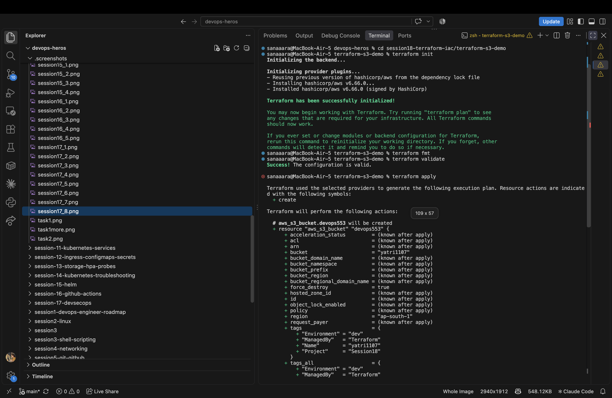
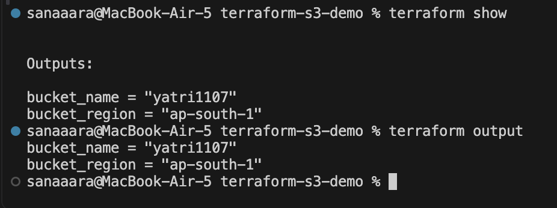

# Session 18 - Terraform & Infrastructure as Code

Practiced the Terraform workflow for an AWS S3 bucket and documented the AWS services used in cloud infrastructure.

---

## Task 1 — Terraform S3 Demo

**Project and complete workflow:** [terraform-s3-demo/README.md](terraform-s3-demo/README.md)

The configuration defines one S3 bucket, `yatri1107`, in `ap-south-1`. The bucket name and region are input variables; the outputs expose the bucket name, ARN, and region.

| File | Purpose |
|---|---|
| [terraform.tf](terraform-s3-demo/terraform.tf) | Terraform requirement and AWS provider dependency |
| [providers.tf](terraform-s3-demo/providers.tf) | AWS provider configuration |
| [main.tf](terraform-s3-demo/main.tf) | S3 bucket resource and tags |
| [variables.tf](terraform-s3-demo/variables.tf) | Bucket name and region inputs |
| [outputs.tf](terraform-s3-demo/outputs.tf) | Bucket details exposed through outputs |
| [.terraform.lock.hcl](terraform-s3-demo/.terraform.lock.hcl) | Selected provider version and checksums |
| [.gitignore](terraform-s3-demo/.gitignore) | Excludes local providers, state, plans, and variable values |

The workflow covers:

```text
init → fmt → validate → plan → apply → show → output → destroy
```

### Initialization, Validation, and Creation Plan

The first screenshot shows the AWS provider initialized, successful configuration validation, and the creation plan displayed by `terraform apply`.



### Inspecting Outputs

The second screenshot shows the values returned by `terraform show` and `terraform output`:

```text
bucket_name = "yatri1107"
bucket_region = "ap-south-1"
```



The screenshots capture the plan and output values. Apply completion and resource destruction are not visible in these captures; the [demo README](terraform-s3-demo/README.md#execution-record) records the available evidence.

---

## Task 2 — AWS Services Research

Each service has a separate README covering its purpose, core concepts, configuration, and common uses.

| Service | Topics | Research |
|---|---|---|
| IAM — Governance | Users, groups, roles, policies, permissions, least privilege, and best practices | [IAM notes](aws-services/01-iam/README.md) |
| EC2 — Compute | AMIs, instance types, key pairs, security groups, EBS, IP addresses, and lifecycle | [EC2 notes](aws-services/02-ec2/README.md) |
| S3 — Storage | Buckets, objects, storage classes, versioning, lifecycle, encryption, and bucket policies | [S3 notes](aws-services/03-s3/README.md) |
| VPC — Networking | CIDR, subnets, routing, internet and NAT gateways, security groups, and NACLs | [VPC notes](aws-services/04-vpc/README.md) |
| DynamoDB & RDS — Databases | NoSQL keys and items, relational engines, security, backups, availability, and read replicas | [Database notes](aws-services/05-dynamodb-rds/README.md) |

These notes are research documentation. The Terraform demo manages an S3 bucket; it does not provision EC2, VPC, or database resources.

---

## What I Learned

- Infrastructure as Code makes resource settings explicit and repeatable.
- Validation checks the configuration; a plan previews changes before they are applied.
- Outputs expose selected values from state and should be interpreted alongside the tracked resources.
- IAM controls access, while compute, storage, networking, and databases serve different parts of an application's infrastructure.
