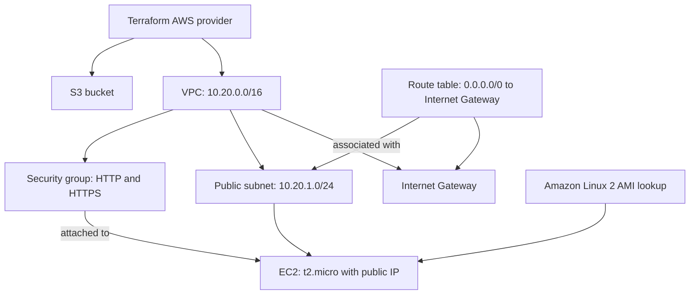
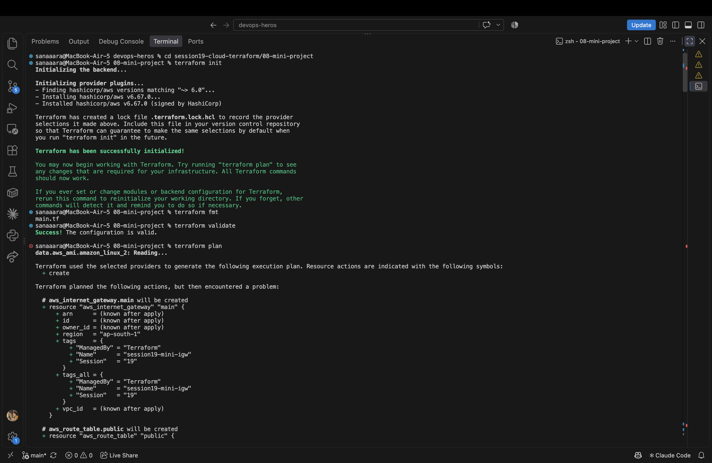

# Session 19 - Cloud & Terraform in Action

An AWS infrastructure project combining a VPC, public subnet, internet gateway, routing, security group, EC2 instance, and S3 bucket. Terraform defines the resources, connects their dependencies, and exposes their details through outputs.

---

## Task — End-to-End Cloud Infrastructure

| File | Purpose |
|---|---|
| [versions.tf](versions.tf) | Terraform requirement, AWS provider dependency, and region configuration |
| [variables.tf](variables.tf) | Region and unique S3 bucket suffix |
| [main.tf](main.tf) | Eight managed resources and an AMI data source |
| [outputs.tf](outputs.tf) | VPC, subnet, security group, EC2 public IP, and S3 bucket details |
| [terraform.tfvars.example](terraform.tfvars.example) | Example region override |
| [.gitignore](.gitignore) | Excludes local provider files, state, and variable values |

### Architecture



The subnet becomes public through its route table's route to the Internet Gateway. The EC2 instance uses that subnet and the web security group. S3 is a separate regional service managed by the same Terraform project.

### Resource Settings

| Component | Configuration |
|---|---|
| Region | `ap-south-1` |
| VPC | `10.20.0.0/16`, DNS support and hostnames enabled |
| Public subnet | `10.20.1.0/24` in `ap-south-1a`, public IP assignment enabled |
| Internet Gateway | Attached to the VPC |
| Route table | Default IPv4 route to the Internet Gateway |
| Route table association | Connects the public subnet to that route table |
| Security group | Inbound TCP 80/443 from `0.0.0.0/0`; outbound IPv4 allowed |
| EC2 | `t2.micro`, Amazon Linux 2 x86_64 AMI, public IP |
| S3 | `session19-mini-bucket-sanaa-24bcs10304`, `force_destroy = true` |

The AMI is looked up through `data.aws_ami.amazon_linux_2`; it is an existing AWS image, not a resource created by this project. The security group permits web traffic, but the EC2 configuration does not install a web server or configure SSH access.

---

## Terraform Workflow

### 1. Configure AWS and Open the Project

From the repository root:

```bash
aws configure
aws sts get-caller-identity
cd session19-cloud-terraform/08-mini-project
```

The region defaults to `ap-south-1`. To override variable values locally:

```bash
cp terraform.tfvars.example terraform.tfvars
```

The example sets the region; `bucket_suffix` retains its default unless added to the local variable file. Credentials and local variable values stay outside the submission.

### 2. Initialize, Format, and Validate

```bash
terraform init
terraform fmt
terraform validate
```

The screenshot records the following output excerpts:

```text
Installing hashicorp/aws v6.67.0...
Installed hashicorp/aws v6.67.0 (signed by HashiCorp)

Terraform has been successfully initialized!
```

`terraform fmt` reformatted `main.tf`. Validation then returned:

```text
Success! The configuration is valid.
```

### 3. Generate the Plan

```bash
terraform plan
```

Terraform reads the AMI data source and builds a proposed set of resource changes. The captured run displays:

```text
data.aws_ami.amazon_linux_2: Reading...

Terraform planned the following actions, but then encountered a problem:

# aws_internet_gateway.main will be created
# aws_route_table.public will be created
```

The screenshot shows part of the proposed network configuration, including the Internet Gateway's region and tags.



**Recorded result:** initialization and validation succeeded; planning encountered a problem. The detailed diagnostic is below the captured area, so the screenshot does not identify its cause or establish a successful plan.

For a fresh run in which the AMI lookup and provider operations succeed, the eight resource blocks would produce this **expected summary**:

```text
Plan: 8 to add, 0 to change, 0 to destroy.
```

A plan previews changes; it does not create the resources. [Terraform plan documentation](https://developer.hashicorp.com/terraform/cli/commands/plan)

### 4. Apply the Infrastructure

After resolving the planning error and reviewing a successful plan:

```bash
terraform apply
```

Enter `yes` at the approval prompt. For a fresh successful deployment, the **expected output format** is:

```text
Apply complete! Resources: 8 added, 0 changed, 0 destroyed.

Outputs:

ec2_public_ip = "<assigned-public-ip>"
s3_bucket_name = "session19-mini-bucket-sanaa-24bcs10304"
security_group_id = "sg-<generated-id>"
subnet_id = "subnet-<generated-id>"
vpc_cidr = "10.20.0.0/16"
vpc_id = "vpc-<generated-id>"
```

The IDs and IP address above are placeholders. This example describes the configuration's outputs; it is not a captured apply result.

### 5. Inspect State and Outputs

```bash
terraform show
terraform output
terraform state list
```

After a successful apply, the **expected state addresses** are:

```text
aws_instance.web
aws_internet_gateway.main
aws_route_table.public
aws_route_table_association.public
aws_s3_bucket.data
aws_security_group.web
aws_subnet.public
aws_vpc.main
data.aws_ami.amazon_linux_2
```

These are eight managed resources and one data source. State connects Terraform's resource addresses to the corresponding AWS objects. `terraform output` displays the values declared in `outputs.tf`. [Terraform state list documentation](https://developer.hashicorp.com/terraform/cli/commands/state/list)

The local state inspected for this write-up contains no managed resources or outputs, so it supplies no additional evidence of a completed deployment.

### 6. Verify in AWS

Following a successful apply, inspect the VPC, subnet, route table, security group, and EC2 instance in the `ap-south-1` console. Confirm that the S3 bucket matches `s3_bucket_name`.

The same checks can be made from the project directory:

```bash
aws ec2 describe-vpcs \
  --region ap-south-1 \
  --vpc-ids "$(terraform output -raw vpc_id)"

aws ec2 describe-instances \
  --region ap-south-1 \
  --filters "Name=tag:Name,Values=session19-mini-web-ec2"

aws s3api head-bucket \
  --region ap-south-1 \
  --bucket "$(terraform output -raw s3_bucket_name)"
```

These commands are verification instructions; their results are not included in the supplied screenshot.

### 7. Destroy the Demo Infrastructure

```bash
terraform plan -destroy
terraform destroy
```

Review the deletion plan and enter `yes` to confirm. If all eight resources were created and remain managed, the **expected completion summary** is:

```text
Destroy complete! Resources: 8 destroyed.
```

The AMI data source is not an owned AWS resource and is not deleted. The S3 bucket's `force_destroy` setting permits removal of its contents during cleanup. Destruction is not shown in the supplied screenshot. [Terraform destroy documentation](https://developer.hashicorp.com/terraform/cli/commands/destroy)

---

## Concepts Demonstrated

| Concept | Where it appears |
|---|---|
| Provider | `hashicorp/aws` configured for `var.aws_region` |
| Variables | Region selection and S3 bucket suffix |
| Resources | VPC, subnet, gateway, routing, security group, EC2, and S3 |
| Data source | Lookup of an existing Amazon Linux 2 AMI |
| Dependencies | Subnet and security group reference the VPC; EC2 references the subnet, security group, and AMI |
| Outputs | Network IDs, EC2 public IP, and S3 bucket name |
| State | Tracks the relationship between configuration and AWS objects after apply |
| Lifecycle | Plan, review, apply, inspect, and destroy |

## What I Learned

- Referencing another resource's attributes lets Terraform infer dependencies.
- Successful validation confirms the configuration is structurally valid; provider operations can still fail during planning.
- A public subnet needs appropriate routing, and an instance also needs a public IP and suitable security group rules.
- Managed resources and data sources have different roles: Terraform creates the former and reads the latter.
