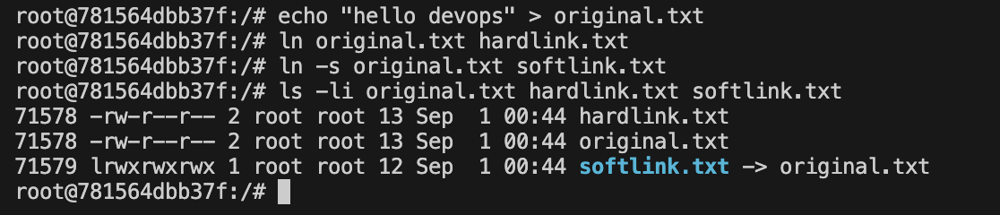
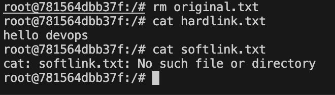
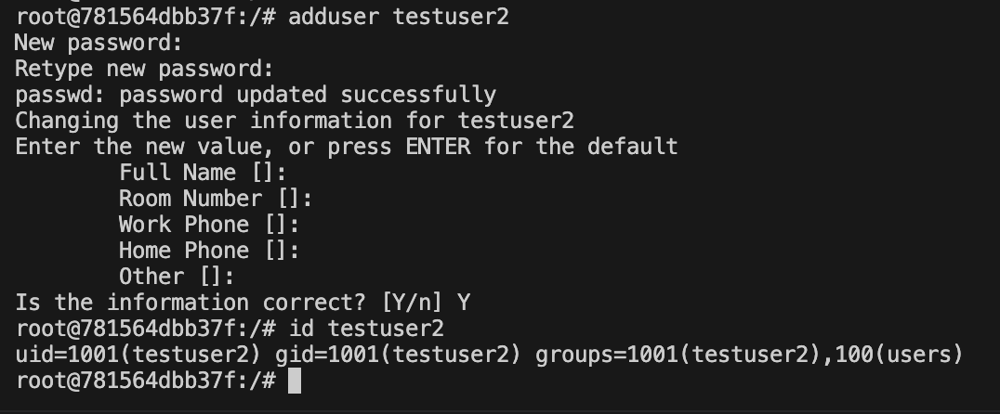

# Session 2 - Linux Assignment

---

## Task 1: Soft Links & Hard Links

A hard link points directly to the actual data (inode) on disk. A soft link (symlink) just points to the file path, like a shortcut. The big difference — if you delete the original file, the hard link still works but the soft link breaks.

```bash
echo "hello devops" > original.txt

# create hard link
ln original.txt hardlink.txt

# create soft link
ln -s original.txt softlink.txt

# check inodes — hard link and original will have the same inode number
ls -li original.txt hardlink.txt softlink.txt
```

Then delete the original to see what happens:

```bash
rm original.txt
cat hardlink.txt   # still works
cat softlink.txt   # broken, file not found
```




---

## Task 2: `adduser` vs `useradd`

`useradd` is the low-level command available on all Linux distros but it doesn't create a home directory or ask for a password by default — you have to pass extra flags manually. `adduser` is a friendlier wrapper (available on Ubuntu/Debian) that handles all of that automatically.

On Ubuntu, `adduser` is the recommended one to use.

```bash
# create a user
adduser testuser2

# verify
id testuser2
cat /etc/passwd | grep testuser2

# cleanup
deluser --remove-home testuser2
```



---

## Task 3: `journalctl`

`journalctl` is used to read logs from systemd — the centralized logging system on Linux. Instead of hunting through files in `/var/log/`, everything is in one place.

Some useful commands:

```bash
journalctl              # view all logs
journalctl -f           # follow logs in real time
journalctl -u ssh       # logs for a specific service
journalctl -u ssh -n 20 # last 20 lines for ssh
journalctl -b           # logs since last boot
journalctl -p err       # errors only
journalctl --since "1 hour ago"
```

Practiced checking logs for the SSH service:

```bash
journalctl -u ssh -n 20
```

Note: `journalctl` requires systemd and doesn't work on macOS or inside basic Docker containers.


---

## Task 4: Linux Command Cheat Sheet

Reviewed and practiced the commands from the cheat sheet. Some of the important ones:

```bash
# files and directories
ls -la        # list everything including hidden files
pwd           # where am i
mkdir -p a/b  # create nested dirs
cp -r src/ dest/
mv old new
rm -rf dir

# viewing files
cat file.txt
head -n 10 file
tail -f file   # follow a file live, useful for logs
grep "word" file
grep -r "word" .

# permissions
chmod +x script.sh
chmod 755 file
chown user:group file

# processes
ps aux
top
kill -9 PID

# disk and system
df -h
du -sh *
free -h
uname -a

# networking
ip a
ping google.com
ss -tuln    # open ports

# users
whoami
id username
sudo command

# packages (ubuntu)
sudo apt update
sudo apt install package
sudo apt remove package
```
