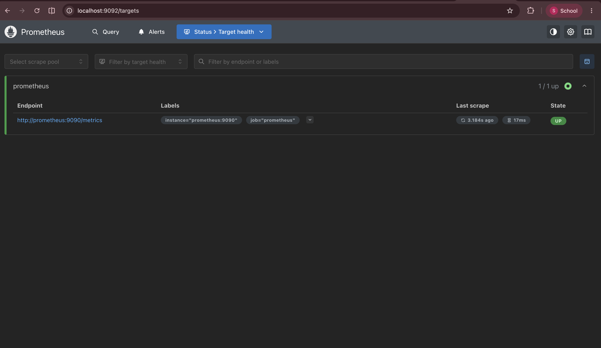
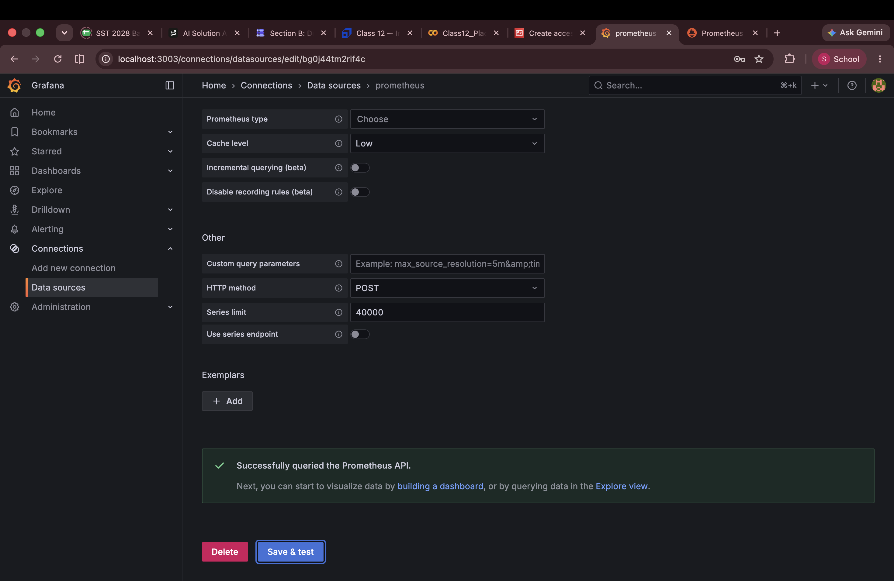
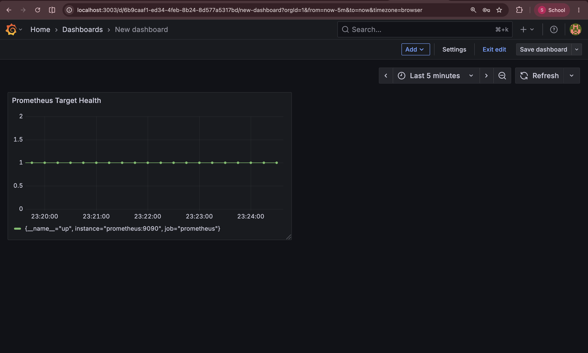
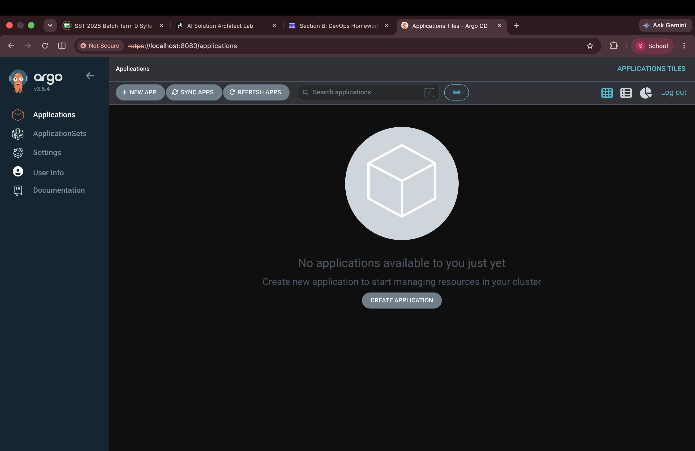
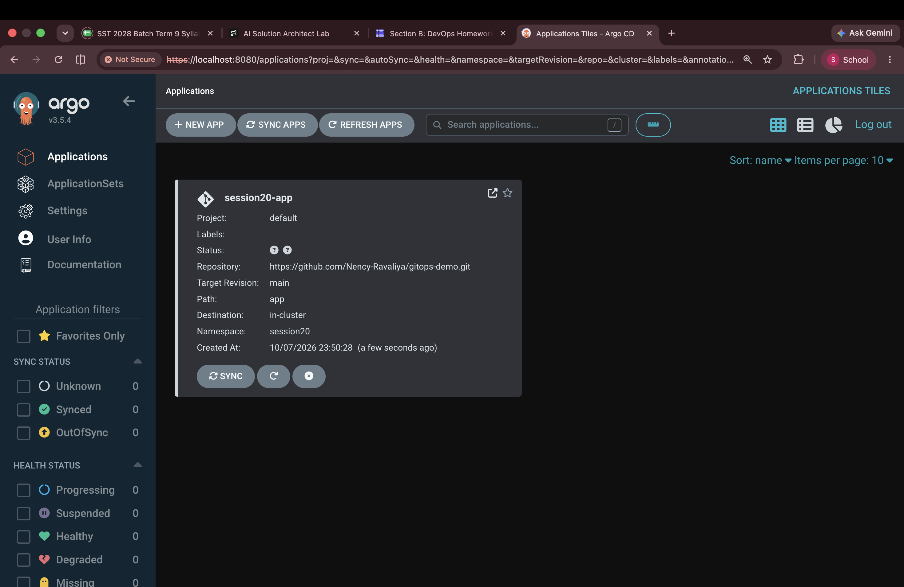

# Session 20 - Monitoring, Observability & GitOps

Ran Prometheus and Grafana with Docker Compose, visualized target health, studied the three observability signals, and deployed an nginx application to Minikube through Argo CD.

---

## Task 1 — Monitoring with Prometheus and Grafana

### Start the Monitoring Stack

From the repository root:

```bash
cd session20-monitoring-observability-gitops/04-grafana
docker compose up -d
docker compose ps
```

The stack uses Prometheus `v3.5.0` and Grafana `12.1.1`. The host ports were changed because other local services already used the original ports.

| Service | Browser address | Container port |
|---|---|---|
| Prometheus | `http://localhost:9092` | `9090` |
| Grafana | `http://localhost:3003` | `3000` |

Both published ports bind to `127.0.0.1`. The configuration is in [docker-compose.yml](04-grafana/docker-compose.yml).

### Check the Prometheus Target

The [Prometheus configuration](04-grafana/prometheus.yml) scrapes Prometheus itself every five seconds:

```yaml
global:
  scrape_interval: 5s

scrape_configs:
  - job_name: prometheus
    static_configs:
      - targets:
          - prometheus:9090
```

Opened `http://localhost:9092/targets`. The target-health page showed one target, `http://prometheus:9090/metrics`, with state **UP**.



### Connect Grafana to Prometheus

Logged in to Grafana with the classroom credentials, `admin` / `admin`, and added a Prometheus data source under **Connections → Data sources**.

The data-source URL is:

```text
http://prometheus:9090
```

Grafana reaches Prometheus over the Compose network using its service name and container port. The browser uses the published host port, `9092`. Using `localhost:9090` inside Grafana caused a connection-refused error because it pointed back to the Grafana container.

After correcting the URL, **Save & test** returned:

```text
Successfully queried the Prometheus API.
```



### Visualize Target Health

Created a **Time series** panel titled **Prometheus Target Health**, selected the Prometheus data source, and ran:

```promql
up
```

The chart shows `up = 1` for `instance="prometheus:9090"`, `job="prometheus"`, across the five-minute window. A value of `1` means the scrape succeeded; `0` means it failed. This panel measures scrape availability, rather than application latency or CPU usage. [Prometheus jobs and instances](https://prometheus.io/docs/concepts/jobs_instances/)



---

## Task 2 — Observability

The research writeup is in [observability/README.md](observability/README.md).

| Signal | What it records | Example question |
|---|---|---|
| Metrics | Numeric measurements over time | Is the error rate increasing? |
| Logs | Individual events with context | Which operation failed, and what error was recorded? |
| Traces | Request paths and the spans within them | Which service contributed most to this request's latency? |

The writeup covers their differences, example data, common tools, and their use in Kubernetes. The practical monitoring stack above collects metrics; logs and traces are covered in the research task.

---

## Task 3 — GitOps with Argo CD

### Install Argo CD on Minikube

Used the existing Minikube cluster:

```bash
kubectl get nodes
kubectl create namespace argocd
kubectl apply -n argocd --server-side --force-conflicts \
  -f https://raw.githubusercontent.com/argoproj/argo-cd/stable/manifests/install.yaml
kubectl get pods -n argocd -w
```

The initial client-side installation failed for `applicationsets.argoproj.io` because its annotations exceeded `262144` bytes. Reapplying with server-side apply installed the missing CRD successfully. This is the installation method recommended by the [Argo CD getting-started guide](https://argo-cd.readthedocs.io/en/stable/getting_started/).

Verified the repair:

```bash
kubectl get crd applicationsets.argoproj.io
kubectl get pods -n argocd
```

All seven Argo CD pods reached `1/1 Running`. The ApplicationSet controller had restarted during the incomplete installation. Pressing `Ctrl+C` stopped the pod watch without stopping the cluster workloads.

### Access the Argo CD Dashboard

Kept this command running in a separate terminal:

```bash
kubectl port-forward svc/argocd-server -n argocd 8080:443
```

Opened `https://localhost:8080`, accepted the local self-signed certificate warning, and logged in as `admin`. Retrieved the initial password locally with:

```bash
kubectl -n argocd get secret argocd-initial-admin-secret \
  -o jsonpath='{.data.password}' | base64 -d
echo
```

The password is omitted from this submission. The first screenshot shows the dashboard before an application was registered.



### Register the GitOps Application

From the repository root:

```bash
kubectl apply -f session20-monitoring-observability-gitops/07-argocd/app/argocd-application.yaml
```

The [Application manifest](07-argocd/app/argocd-application.yaml) defines:

| Setting | Value |
|---|---|
| Application | `session20-app` in namespace `argocd` |
| Git repository | `https://github.com/Nency-Ravaliya/gitops-demo.git` |
| Revision and path | Branch `main`, directory `app` |
| Destination | Local cluster, namespace `session20` |
| Automated sync | Enabled |
| Pruning | Enabled; removes managed resources deleted from Git |
| Self-healing | Enabled; reconciles changes made directly in the cluster |
| Namespace creation | `CreateNamespace=true` |

```text
Git repository: main / app
             |
             v
Argo CD compares Git with the cluster
             |
             v
Minikube: session20 namespace
             |
             +-- Deployment: session20-gitops-app (5 nginx replicas)
             +-- Service: session20-gitops-app (port 80)
```

This screenshot records the application immediately after registration, before its status had populated:



### Verify the Deployment

Checked the cluster after reconciliation:

```bash
kubectl get applications -n argocd
kubectl get all -n session20
```

The following output was verified directly against the local cluster. Age columns are omitted:

```text
NAME            SYNC STATUS   HEALTH STATUS
session20-app   Synced        Healthy

NAME                                        READY   STATUS    RESTARTS
pod/session20-gitops-app-679fcbbd85-kfgb7   1/1     Running   0
pod/session20-gitops-app-679fcbbd85-kwzjq   1/1     Running   0
pod/session20-gitops-app-679fcbbd85-mw2qg   1/1     Running   0
pod/session20-gitops-app-679fcbbd85-px8gl   1/1     Running   0
pod/session20-gitops-app-679fcbbd85-xgx6t   1/1     Running   0

NAME                           TYPE        CLUSTER-IP    EXTERNAL-IP   PORT(S)
service/session20-gitops-app   ClusterIP   10.96.43.80   <none>        80/TCP

NAME                                   READY   UP-TO-DATE   AVAILABLE
deployment.apps/session20-gitops-app   5/5     5            5

NAME                                              DESIRED   CURRENT   READY
replicaset.apps/session20-gitops-app-679fcbbd85   5         5         5
```

Argo CD reported a successful automated sync of Git revision `5c2c67fae0acccbb1233f56d3377cca402de8666`. The deployed image was `nginx:1.27-alpine`. **Synced** confirms the managed manifests match Git; **Healthy** means Argo CD considers the deployed resources healthy. The Deployment also reports all five replicas ready and available.

The application watches the teacher's repository. Editing the local demonstration files alone does not change that remote source; a separate GitOps exercise using my own repository would require updating `repoURL`.

---

## Troubleshooting Record

| Issue | Cause | Resolution |
|---|---|---|
| Compose could not bind port `9090` | An existing Prometheus instance already used it | Published this stack on `9092`; used `3003` for Grafana |
| Grafana could not query Prometheus | Data-source URL used `localhost` inside the Grafana container | Changed it to `http://prometheus:9090` |
| Dashboard showed data only at the far right | Six-hour range included time before the new stack started | Selected the last five minutes |
| ApplicationSet CRD was not installed | Client-side apply exceeded the annotation size limit | Reapplied the installation with server-side apply |
| Browser showed a certificate warning | Argo CD used its default self-signed certificate | Accepted the certificate for the local HTTPS endpoint |

## Cleanup Commands

From the repository root, stop the monitoring stack:

```bash
docker compose -f session20-monitoring-observability-gitops/04-grafana/docker-compose.yml down
```

Optional GitOps cleanup, after recording the results:

```bash
kubectl delete -f session20-monitoring-observability-gitops/07-argocd/app/argocd-application.yaml
kubectl delete namespace session20
```

Deleting the namespace removes its remaining workloads. Argo CD can stay installed for later exercises; stop its local port-forward with `Ctrl+C` when finished.
