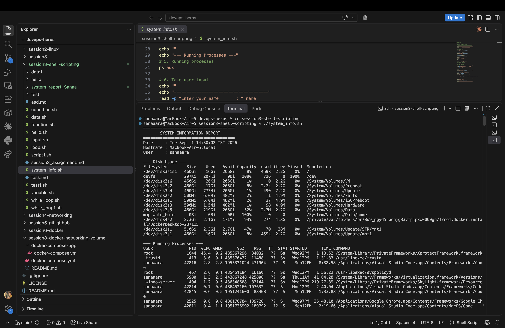
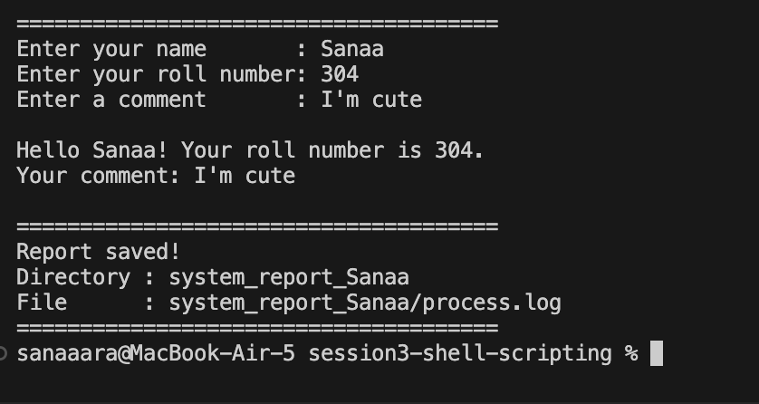

# Session 3 - Shell Scripting Assignment

## Task: System Information Script

Created a shell script `system_info.sh` that prints system info, takes user input, creates a directory and file, and stores running processes in it.

---

## How to Run

```bash
chmod +x system_info.sh
./system_info.sh
```

---

## What the Script Does

- Stores date, hostname, and username in variables using `$()`
- Prints disk usage with `df -h`
- Prints running processes with `ps aux`
- Takes name, roll number, and a comment from the user via `read -p`
- Creates a directory named `system_report_<name>` using `mkdir`
- Creates a `process.log` file inside it using `touch`
- Dumps all running processes into the file using `ps aux > process.log`

---

## Output



