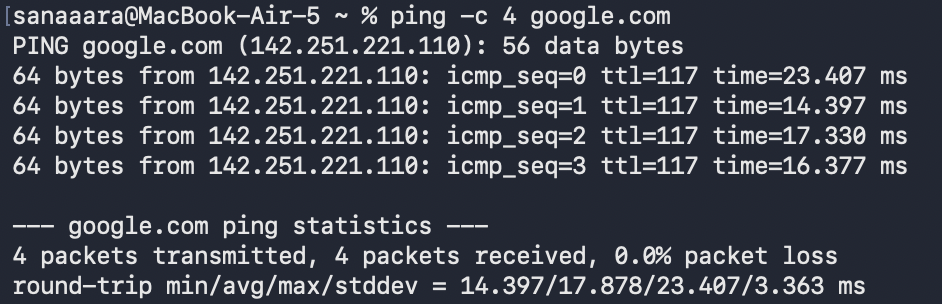
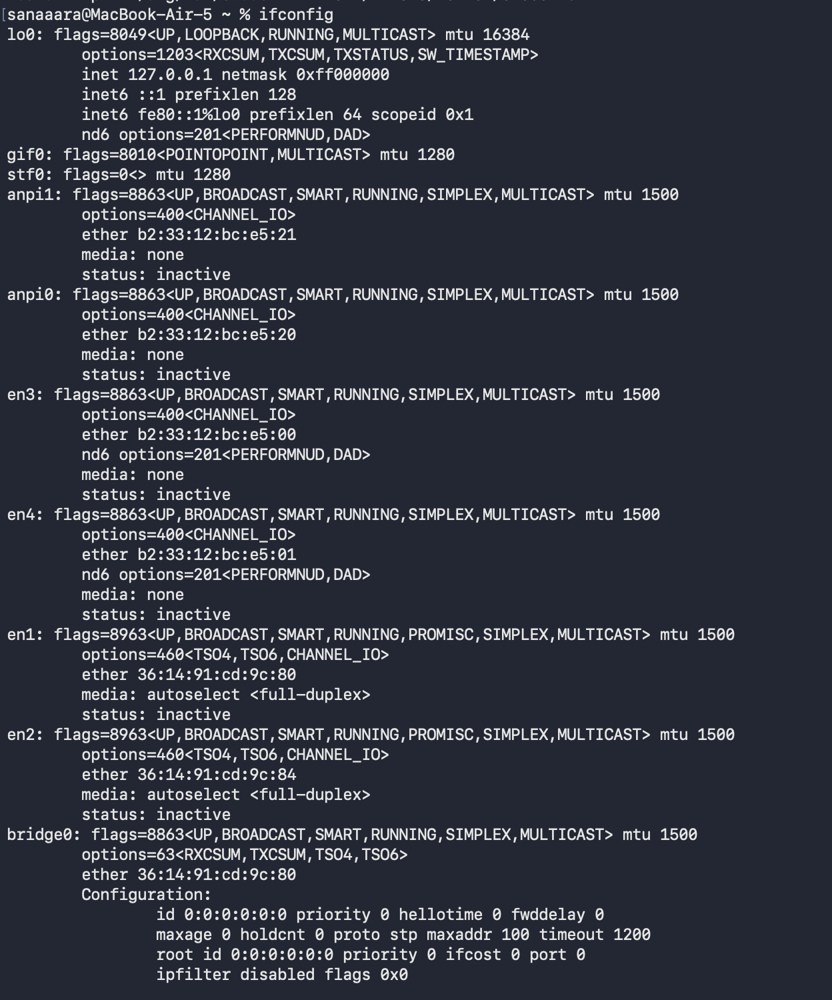
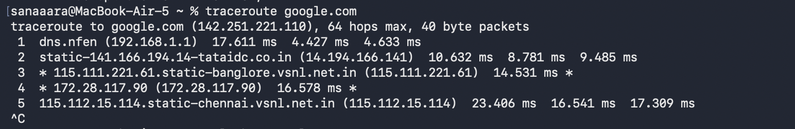
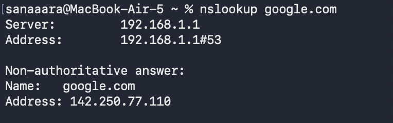
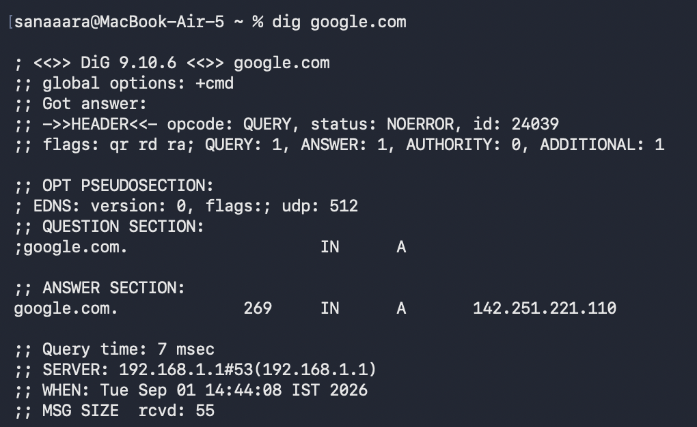
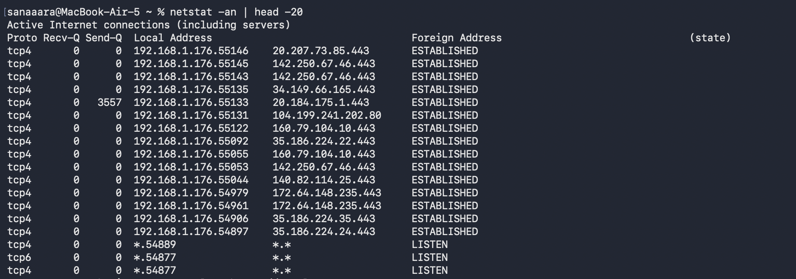
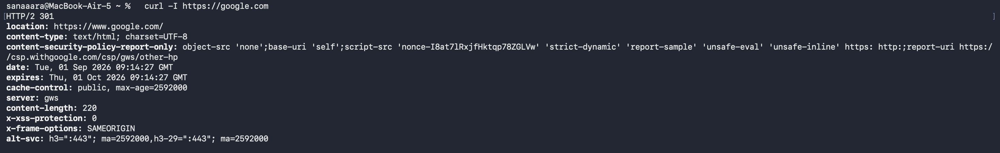
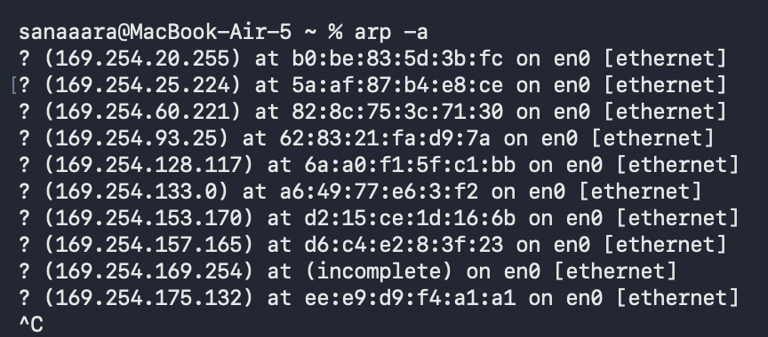
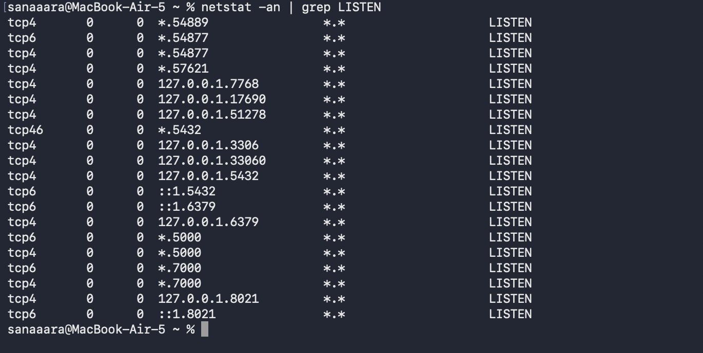

# Session 4 - Networking Assignment

Practiced networking commands and documented the output with explanations.

---

## 1. `ping`

Tests connectivity to a host by sending packets and measuring response time.

```bash
ping -c 4 google.com
```



---

## 2. `ifconfig` / `ip a`

Shows all network interfaces and their IP addresses assigned to your machine.

```bash
ifconfig
```



---

## 3. `traceroute`

Shows the path packets take to reach a destination, hop by hop.

```bash
traceroute google.com
```



---

## 4. `nslookup`

Queries DNS to find the IP address of a domain name.

```bash
nslookup google.com
```



---

## 5. `dig`

Like nslookup but more detailed. Shows the full DNS response including TTL, record type, and which DNS server answered.

```bash
dig google.com
```



---

## 6. `netstat`

Shows active network connections, open ports, and routing info.

```bash
netstat -an | head -20
```



---

## 7. `curl`

Makes HTTP requests from the terminal. Useful for testing APIs and checking if a URL is reachable.

```bash
curl -I https://google.com
```



---

## 8. `arp -a`

Shows the ARP table — the mapping of IP addresses to MAC addresses on the local network.

```bash
arp -a
```



---

## 9. `ss`

Modern replacement for netstat. Shows socket connections and open ports faster and with more detail.
(ss doesn't work on mac)
```bash
netstat -an | grep LISTEN
```


