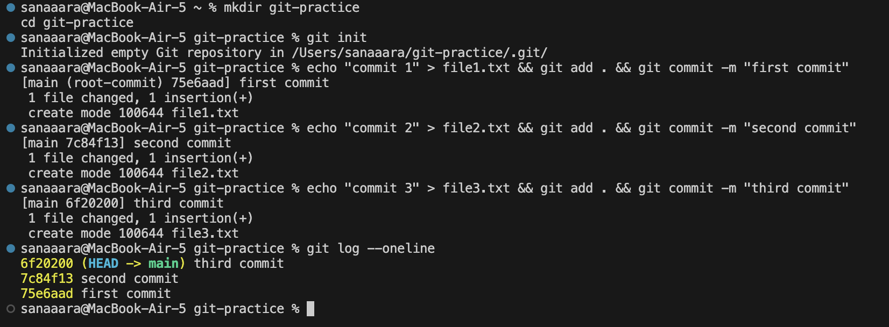
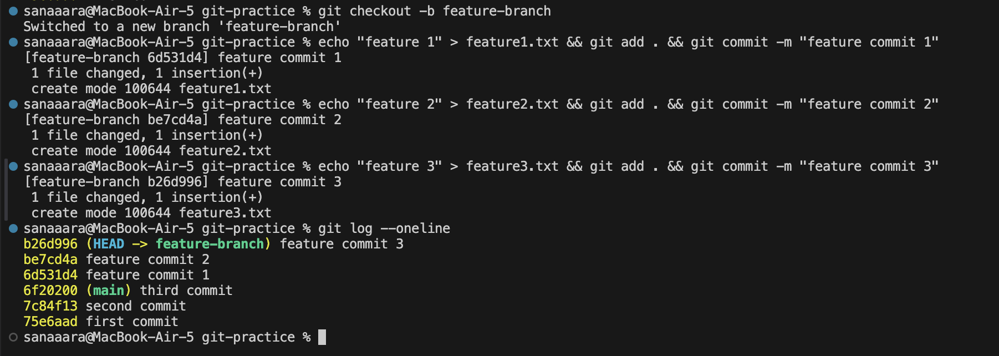
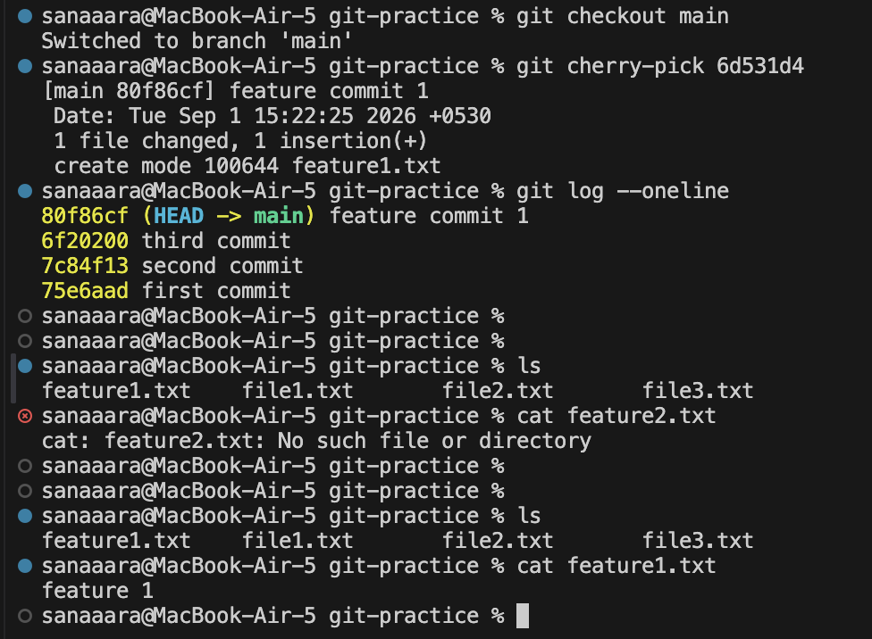

# Session 5 - Git & GitHub Assignment

---

## Task 1: `git commit -a -m` vs `git commit -m`

**`git commit -m`** only commits files you've explicitly staged with `git add`.

**`git commit -a -m`** automatically stages all modified tracked files and commits them in one step. It skips `git add` — but only for files git already knows about (tracked files). New/untracked files still need `git add`.

```bash
# normal flow
git add file.txt
git commit -m "your message"

# shortcut — skips git add for already tracked files
git commit -a -m "your message"
```

---

## Task 2: Git Cherry-Pick

Cherry-pick lets you pick a specific commit from one branch and apply it to another — without merging the whole branch.

### Step 1 — set up a practice repo

```bash
mkdir git-practice
cd git-practice
git init
```

### Step 2 — make commits on main

```bash
echo "commit 1" > file1.txt && git add . && git commit -m "first commit"
echo "commit 2" > file2.txt && git add . && git commit -m "second commit"
echo "commit 3" > file3.txt && git add . && git commit -m "third commit"
git log --oneline
```



### Step 3 — create a new branch and make commits

```bash
git checkout -b feature-branch
echo "feature 1" > feature1.txt && git add . && git commit -m "feature commit 1"
echo "feature 2" > feature2.txt && git add . && git commit -m "feature commit 2"
echo "feature 3" > feature3.txt && git add . && git commit -m "feature commit 3"
git log --oneline
```



### Step 4 — cherry-pick one commit into main

Copy the hash of the commit you want (from the log above), then:

```bash
git checkout main
git cherry-pick <commit-hash>
git log --oneline
```

Cherry-picked commit `6d531d4` (feature commit 1) into main. Verified with `ls` that `feature1.txt` is now in main — only that one commit came over, not the rest of the feature branch.


