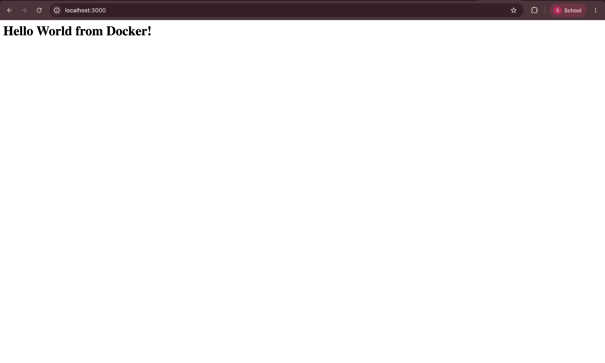
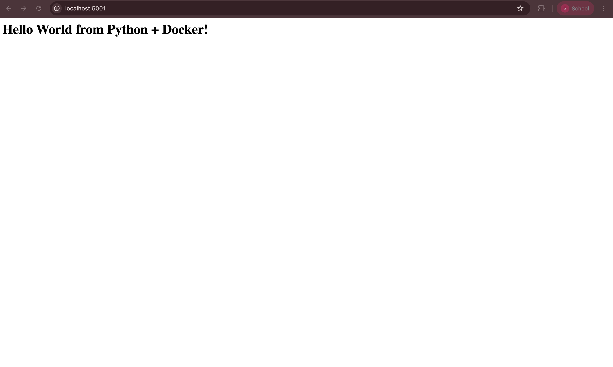
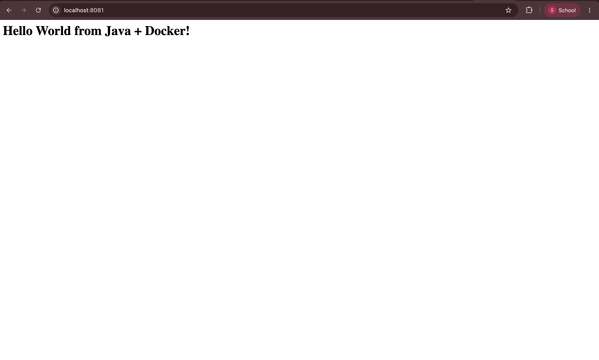
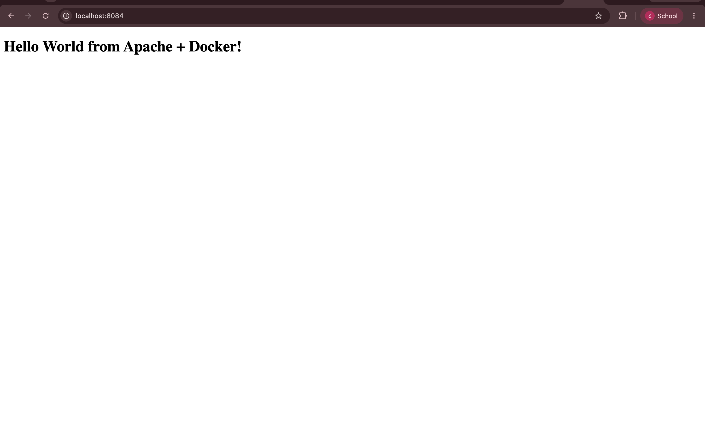
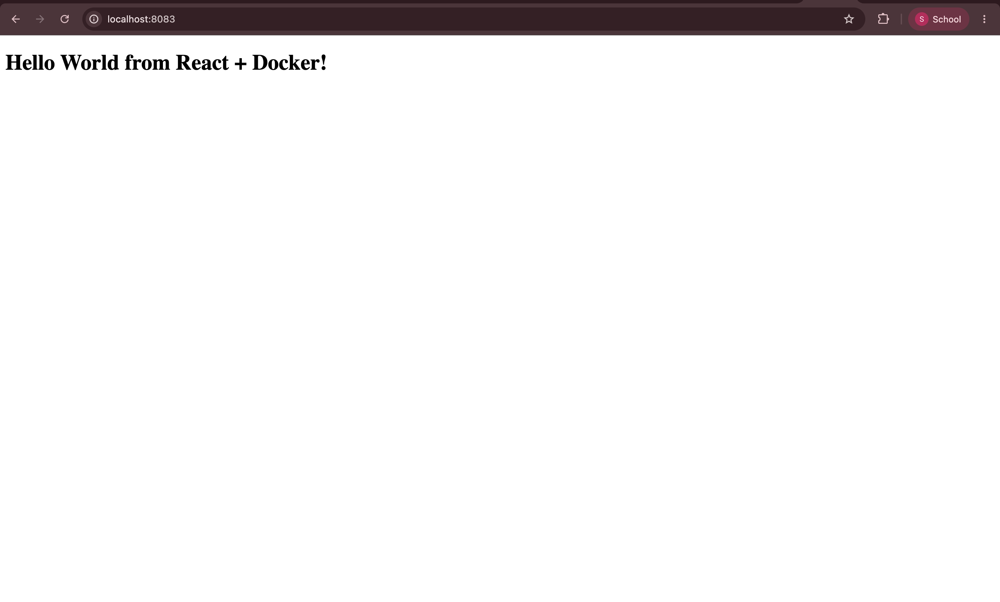

# Session 6 - Docker Assignment

Hello World web applications using Docker across 6 different stacks. The `node-app`, `python-app`, and `nginx-web` folders were already part of the repo — I built and ran those, and also created `java-app`, `Apache-app`, and `React-app` from scratch.

---

## 1. Node.js — `node-app`

```bash
cd node-app
docker build -t node-app .
docker run -d -p 3000:3000 node-app
```



---

## 2. Python (Flask) — `python-app`

```bash
cd python-app
docker build -t python-app .
docker run -d -p 5001:5000 python-app
```



---

## 3. Nginx — `nginx-web`

```bash
cd nginx-web
docker build -t nginx-web .
docker run -d -p 8080:80 nginx-web
```


---

## 4. Java — `java-app`

```bash
cd java-app
docker build -t java-app .
docker run -d -p 8081:8080 java-app
```



---

## 5. Apache — `Apache-app`

```bash
cd Apache-app
docker build -t apache-app .
docker run -d -p 8084:80 apache-app
```



---

## 6. React — `React-app`

Multi-stage build — Node.js builds the app, Nginx serves it.

```bash
cd React-app
docker build -t react-app .
docker run -d -p 8083:80 react-app
```


