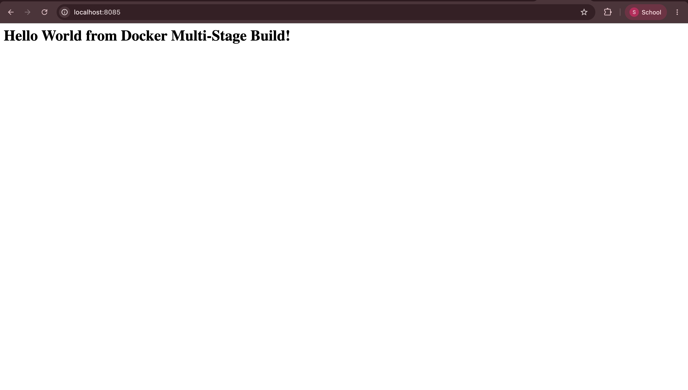
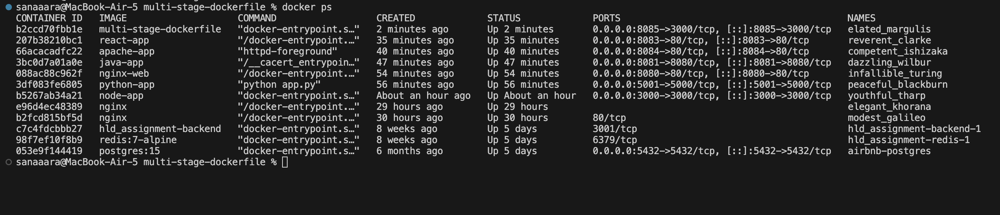

# Session 7 - Docker Multi-Stage Build Assignment

**Name:** Sanaa  
**Roll Number:** 24BCS10304

---

## Task 1: Multi-Stage Dockerfile

The multi-stage Dockerfile was already in the repo under `multi-stage-dockerfile/`. It has two stages — Stage 1 installs all dependencies and builds the app, Stage 2 copies only what's needed for production, keeping the final image lean.

```bash
cd multi-stage-dockerfile
docker build -t multi-stage-dockerfile .
docker run -d -p 8085:3000 multi-stage-dockerfile
```

App running at http://localhost:8085



`docker ps` output confirming the container is running:



---

## Task 2: Why Multi-Stage Builds?

A regular Dockerfile includes everything — build tools, dev dependencies, source files — in the final image, making it bloated. A multi-stage build separates the build environment from the runtime environment. The final image only contains what the app actually needs to run, so it's smaller and more secure.

---

## Task 3: Docker Application Deployment

Already deployed 3 different application types in Session 6:

- **Node.js** — `node-app/` — Express server on port 3000
- **Python** — `python-app/` — Flask server on port 5001  
- **Java** — `java-app/` — Java HTTP server on port 8081
