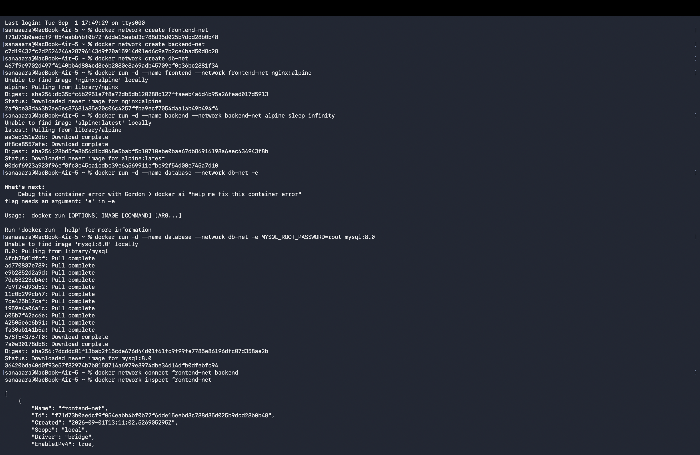
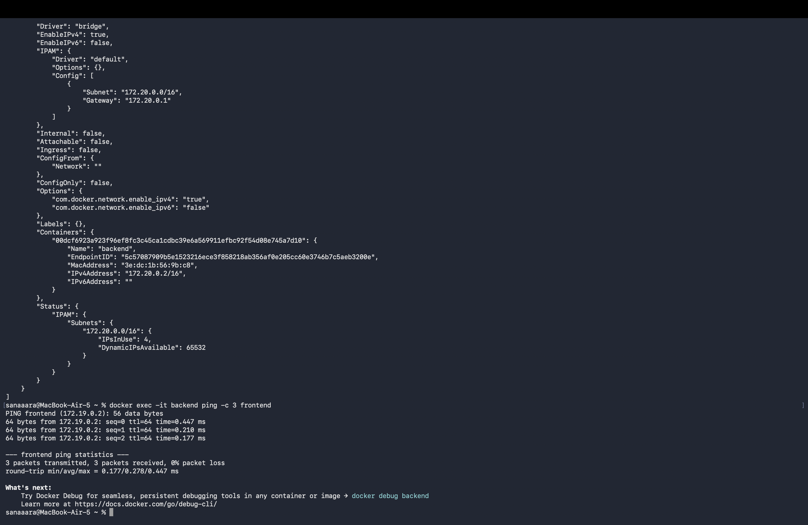
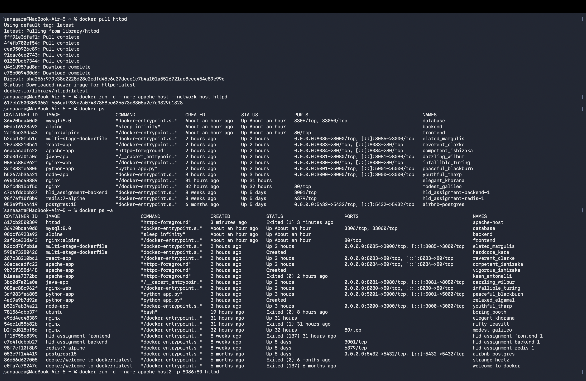
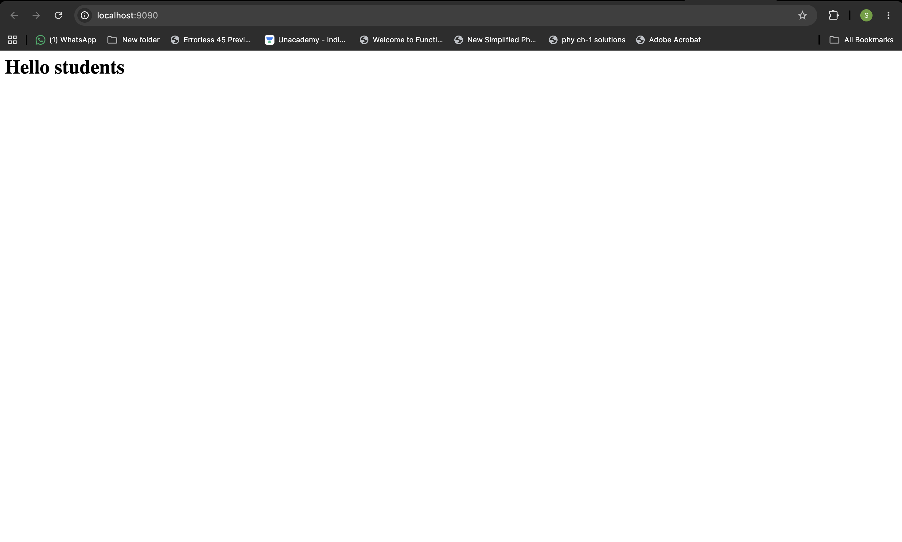
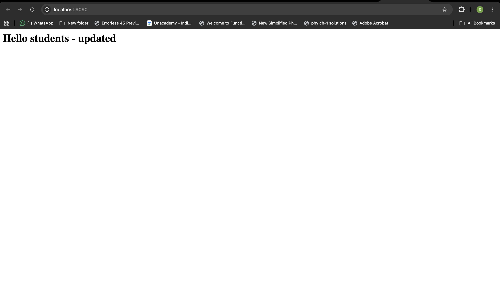

# Session 8 - Docker Networking & Volume Assignment

---

## Task 1: Docker Container Networking

Created 3 containers (frontend, backend, database) across 3 different networks. The backend is connected to 2 networks so it can talk to both frontend and database.

```bash
# create 3 networks
docker network create frontend-net
docker network create backend-net
docker network create db-net

# create containers
docker run -d --name frontend --network frontend-net nginx:alpine
docker run -d --name backend --network backend-net alpine sleep infinity
docker run -d --name database --network db-net -e MYSQL_ROOT_PASSWORD=root mysql:8.0

# add backend to a second network so it can reach frontend
docker network connect frontend-net backend

# verify networks
docker network inspect frontend-net
docker network inspect backend-net

# check connectivity — exec into backend and ping frontend
docker exec -it backend ping -c 3 frontend
```




---

## Task 2: Host Network

The Apache image on Docker Hub is called `httpd`. Pulled and ran it using the host network so the container shares the host's network stack directly without port mapping.

```bash
docker pull httpd
docker run -d --name apache-host --network host httpd
```

Access at: http://localhost:80

> Note: `--network host` is a Linux feature. On macOS with Docker Desktop it works inside the VM but port 80 is still accessible on localhost.




---

## Task 3: Bind Mount

Created a local folder with an `index.html` file and mounted it into an Nginx container. Any changes to the local file reflect immediately inside the container without restart.

```bash
# create folder and file
mkdir ~/nginx-bindmount
echo "<h1>Hello students</h1>" > ~/nginx-bindmount/index.html

# run nginx with bind mount
docker run -d --name nginx-bind -p 9090:80 -v ~/nginx-bindmount:/usr/share/nginx/html nginx

# verify
open http://localhost:9090

# modify the file and check live changes (no restart needed)
echo "<h1>Hello students - updated!</h1>" > ~/nginx-bindmount/index.html
```

Refresh http://localhost:9090 to see the updated content without restarting the container.




---

## Task 4: Overlay Network

Overlay networks connect Docker containers across **multiple hosts** (machines). Unlike bridge networks which are limited to a single host, overlay networks span across a Docker Swarm cluster.

**How it works:**
- Requires Docker Swarm mode to be initialized
- Docker creates a distributed key-value store to track network state across all nodes
- Containers on different physical machines can communicate as if they're on the same local network
- Traffic between hosts is encapsulated using VXLAN tunneling

**Use cases:**
- Microservices spread across multiple servers
- High availability setups where services run on different nodes
- Production Docker Swarm deployments

```bash
# to use overlay networks, first init swarm mode
docker swarm init

# then create an overlay network
docker network create --driver overlay my-overlay-net
```

Overlay networks are not needed for single-host setups — bridge networks handle that. They become essential when scaling out to multiple machines.
