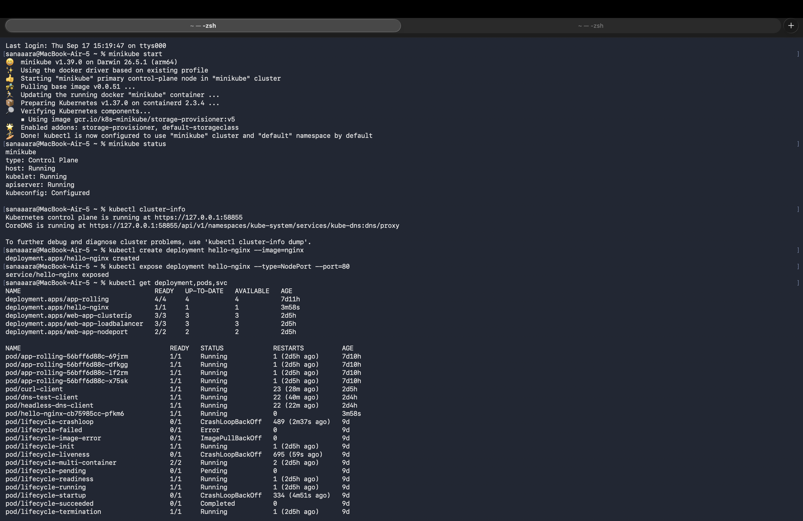
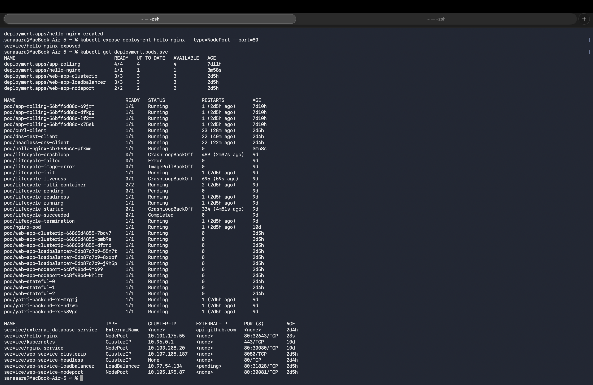
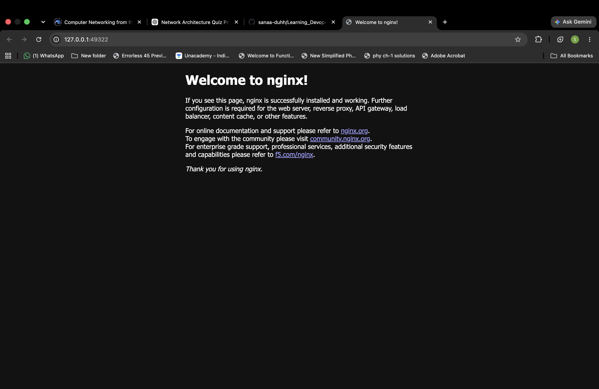

# Session 9 - Kubernetes Fundamentals

Set up a local Kubernetes cluster on my Mac using Minikube and deployed a hello world nginx app to verify everything works.

---

## Setup

Installed Minikube and kubectl via Homebrew:

```bash
brew install minikube kubectl
```

Started the cluster:

```bash
minikube start
```

## Verifying the cluster

```bash
minikube status
kubectl get nodes
kubectl cluster-info
```



---

## Deploying my first app

Created a simple nginx deployment and exposed it as a NodePort service:

```bash
kubectl create deployment hello-nginx --image=nginx
kubectl expose deployment hello-nginx --type=NodePort --port=80
kubectl get deployment,pods,svc
```



---

## Accessing it

```bash
minikube service hello-nginx
```

This opens the nginx welcome page in the browser.



---

## Kubernetes architecture (notes)

**Control Plane (master node) components:**
- **etcd** — key-value store holding all cluster state
- **API server** — front door to the cluster, everything goes through here
- **Scheduler** — decides which node a pod runs on
- **Controller Manager** — runs controllers that keep the cluster in the desired state

**Worker Node components:**
- **kubelet** — agent that talks to the API server and runs pods on the node
- **kube-proxy** — handles networking rules so services can reach pods
- **Container Runtime (CRI)** — actually runs the containers (containerd, CRI-O, etc.)

Minikube runs both the control plane and a single worker on one VM, which is why `kubectl get nodes` shows just one node.
